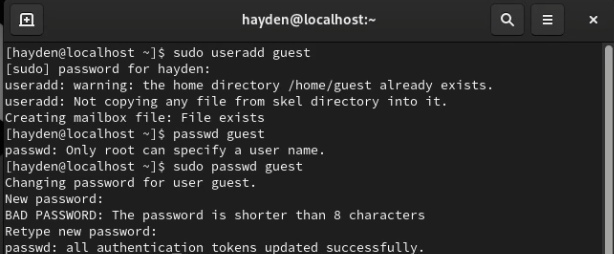
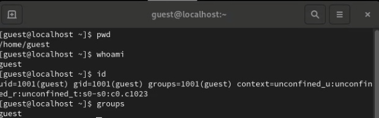
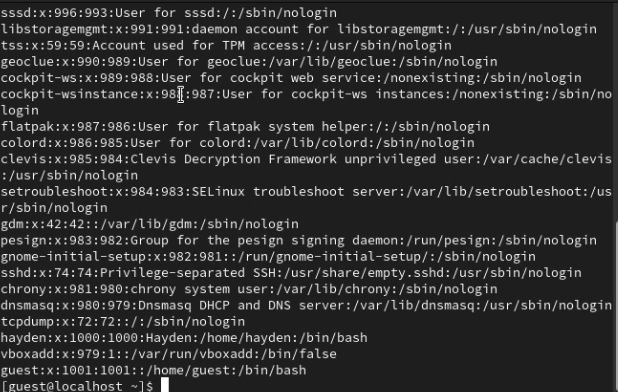
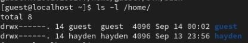
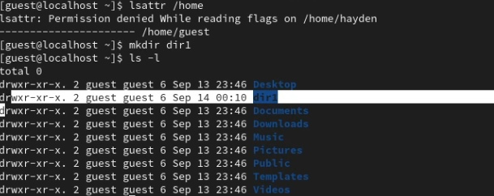
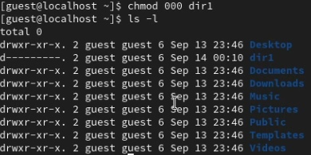
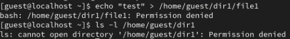

---
## Front matter
lang: ru-RU
title: "Основы информационной безопасности"
subtitle: "Лабораторная работа № 2. Дискреционное разграничение прав в Linux. Основные атрибуты"
author: |
	Подлесный Иван Сергеевич.
institute: Российский Университет дружбы народов
date: 14.09.2024

## i18n babel
babel-lang: russian
babel-otherlangs: english

## Formatting pdf
toc: false
toc-title: Содержание
slide_level: 2
aspectratio: 169
section-titles: true
theme: metropolis
header-includes:
 - \metroset{progressbar=frametitle,sectionpage=progressbar,numbering=fraction}
 - '\makeatletter'
 - '\beamer@ignorenonframefalse'
 - '\makeatother'
---

# Информация

## Докладчик

  * Подлесный Иван Сергеевич
  * студент группы НКНбд-01-21
  * Российский университет дружбы народов

# Вводная часть

## Цель Работы
Получение практических навыков работы в консоли с атрибутами файлов, закрепление теоретических основ дискреционного разграничения доступа в современных системах с открытым кодом на базе ОС Linux
# Ход работы

## Шаги 1-2

 Выполняем шаги 1-2:
  - Создаем нового гостевого пользователя (guest) "sudo useradd guest"
  - Задаём ему пароль "sudo passwd guest"

{#fig:001 width=70%}

## Шаги 3-7

  - Входим в систему через пользователя guest
  - Определяем директорию, в которой находится пользователь командой "pwd" и определяем является ли она домашней
  - Директория является домашней
  - Уточняем имя пользователя командой "whoami"
  - Уточняем имя пользователя, его группу, а также группы, куда входит пользователь, командой id, потом сравниваем вывод id с выводом команды groups.

## Шаги 3-7

{#fig:002 width=70%}

## Выполняем шаг 8:

- Просматриваем файл /etc/passwd командой "cat /etc/passwd" и находим в нём свою учётную запись. Определяем uid пользователя и gid пользователя. Сравните найденные значения с полученными в предыдущих пунктах.
Данные uid и gid пользователя guest никак не различаются.

## Выполняем шаг 8:

{#fig:005 width=70%}

## Выполняем шаг 9:

 - Определите существующие в системе директории командой ls -l /home/
Удалось  получить список поддиректорий директории /home. На каждой директории установлены права на чтение, запись и исполнение, но только для владельцев(не включая группы и остальных пользователей).

## Выполняем шаг 9:

{#fig:006 width=70%}

## Выполняем шаги 10-11

- Проверяем, какие расширенные атрибуты установлены на поддиректориях, находящихся в директории /home, командой "lsattr /home". Удалось увидеть расширенные атрибуты только своей директорий

- Создаем в домашней директории поддиректорию dir1 командой "mkdir dir1"
Определяем командами ls -l и lsattr, и просматриваем права доступа и аттрибуты
(Владелец -- чтение,исполнение,запись. Группа -- чтение и исполнение. Остальные -- чтение)

## Выполняем шаги 10-11

{#fig:007 width=70%}

##  Выполняем шаг 12

- Снимаем с директории dir1 все атрибуты командой "chmod 000 dir1" и проверяем правильность выполнения с помощью команды "ls -l"

{#fig:009 width=70%}

##  Выполняем шаги 13
Попытался создать в директории dir1 файл file1 командой "echo "test" > /home/guest/dir1 file1"
Отказ был получен так как, мы поменяли аттрибуты на те, которые не позволяют проводить с папкой операцию чтения и записи.

{#fig:010 width=70%}

## Шаг 14:
 Таблица минимальных прав доступа на совершения действий с файлами и папками

| Операция | Минимальные права на директорию | Минимальные права на файл |
|----------|---------------------------------|---------------------------|
|Создание файла|            d(300)               |               (000)            |
|Удаление файла|            d(300)               |               (000)            |
|Чтение файла|            d(100)               |               (400)            |
|Запись в файл|            d(100)               |               (200)            |
|Переименование файла |            d(300)               |               (000)            |
|Создание поддиректории |            d(300)               |               (000)            |
|Удаление поддиректории |            d(300)               |               (000)            |

# Заключение

## Выводы
Мы получили практические навыки работы в консоли с атрибутами файлов, закрепили теоретические основы дискреционного разграничения доступа в современных системах с открытым кодом на базе ОС Linux

