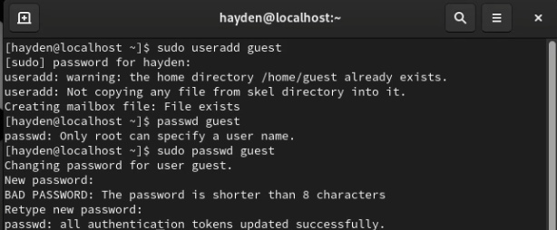
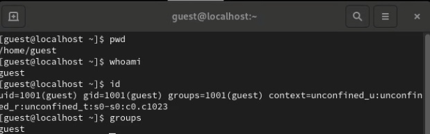
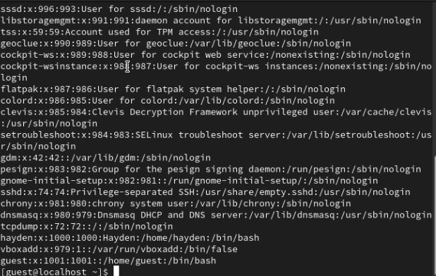
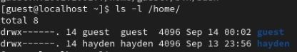
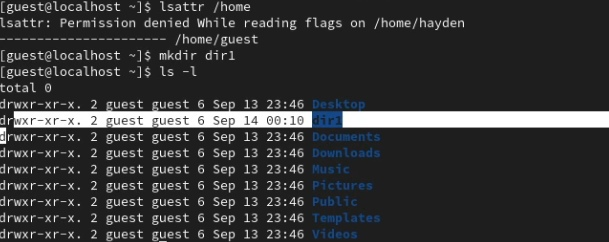
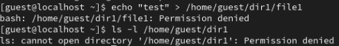

---
## Front matter
title: "Основы информационной безопасности"
subtitle: "Лабораторная работа № 2. Дискреционное разграничение прав в Linux. Основные атрибуты"
author: "Подлесный Иван Сергеевич"

## Generic otions
lang: ru-RU
toc-title: "Содержание"

## Bibliography

## Pdf output format
toc: true # Table of contents
toc-depth: 2
lof: true # List of figures
lot: true # List of tables
fontsize: 12pt
linestretch: 1.25
papersize: a4
documentclass: scrreprt
## I18n polyglossia
polyglossia-lang:
  name: russian
  options:
	- spelling=modern
	- babelshorthands=true
polyglossia-otherlangs:
  name: english
## I18n babel
babel-lang: russian
babel-otherlangs: english
## Fonts
mainfont: Open Sans
romanfont: Open Sans
sansfont: Open Sans
monofont: Open Sans
mainfontoptions: Ligatures=TeX
romanfontoptions: Ligatures=TeX
sansfontoptions: Ligatures=TeX,Scale=MatchLowercase
monofontoptions: Scale=MatchLowercase,Scale=0.9
## Biblatex
biblatex: true
biblio-style: "gost-numeric"
biblatexoptions:
  - parentracker=true
  - backend=biber
  - hyperref=auto
  - language=auto
  - autolang=other*
  - citestyle=gost-numeric
## Pandoc-crossref LaTeX customization
figureTitle: "Рис."
tableTitle: "Таблица"
listingTitle: "Листинг"
lofTitle: "Список иллюстраций"
lotTitle: "Список таблиц"
lolTitle: "Листинги"
## Misc options
indent: true
header-includes:
  - \usepackage{indentfirst}
  - \usepackage{float} # keep figures where there are in the text
  - \floatplacement{figure}{H} # keep figures where there are in the text
---

# Постановка задачи

Получение практических навыков работы в консоли с атрибутами файлов, закрепление теоретических основ дискреционного разграничения доступа в современных системах с открытым кодом на базе ОС Linux

# Выполнение лабораторной работы

1. Выполняем шаги 1-2:
  - Создаем нового гостевого пользователя (guest) "sudo useradd guest"
  - Задаём ему пароль "sudo passwd guest"

{#fig:001 width=70%}

2. Проходим шаги 3-7:
  - Входим в систему через пользователя guest
  - Определяем директорию, в которой находится пользователь командой "pwd" и определяем является ли она домашней
  - Директория является домашней
  - Уточняем имя пользователя командой "whoami"
  - Уточняем имя пользователя, его группу, а также группы, куда входит пользователь, командой id, потом сравниваем вывод id с выводом команды groups.

{#fig:002 width=70%}

3. Выполняем шаг 8:
- Просматриваем файл /etc/passwd командой "cat /etc/passwd" и находим в нём свою учётную запись. Определяем uid пользователя и gid пользователя. Сравните найденные значения с полученными в предыдущих пунктах.
Данные uid и gid пользователя guest никак не различаются.

{#fig:005 width=70%}

4. Выполняем шаг 9:
 - Определите существующие в системе директории командой ls -l /home/
Удалось  получить список поддиректорий директории /home. На каждой директории установлены права на чтение, запись и исполнение, но только для владельцев(не включая группы и остальных пользователей).

{#fig:006 width=70%}

5. Выполняем шаги 10-11:
- Проверяем, какие расширенные атрибуты установлены на поддиректориях, находящихся в директории /home, командой "lsattr /home"

- Удалось увидеть расширенные атрибуты только своей директорий

- Создаем в домашней директории поддиректорию dir1 командой "mkdir dir1"
Определяем командами ls -l и lsattr, какие права доступа и расширенные атрибуты были выставлены на директорию dir1. (Владелец -- чтение,исполнение,запись. Группа -- чтение и исполнение. Остальные -- чтение)

{#fig:007 width=70%}

6. Выполняем шаг 12:

- Снимаем с директории dir1 все атрибуты командой "chmod 000 dir1" и проверяем правильность выполнения с помощью команды "ls -l"

{#fig:009 width=70%}

7. Выполняем шаг 13:
- Попытался создать в директории dir1 файл file1 командой "echo "test" > /home/guest/dir1 file1"
Отказ был получен так как, мы поменяли аттрибуты на те, которые не позволяют проводить с папкой операцию чтения и записи.
Файл также не удалось создать .

{#fig:010 width=70%}

8. Шаг 14:
 Таблица минимальных прав доступа на совершения действий с файлами и папками

| Операция | Минимальные права на директорию | Минимальные права на файл |
|----------|---------------------------------|---------------------------|
|Создание файла|            d(300)               |               (000)            |
|Удаление файла|            d(300)               |               (000)            |
|Чтение файла|            d(100)               |               (400)            |
|Запись в файл|            d(100)               |               (200)            |
|Переименование файла |            d(300)               |               (000)            |
|Создание поддиректории |            d(300)               |               (000)            |
|Удаление поддиректории |            d(300)               |               (000)            |

# Выводы

Мы получили практические навыки работы в консоли с атрибутами файлов, закрепили теоретические основы дискреционного разграничения доступа в современных системах с открытым кодом на базе ОС Linux
