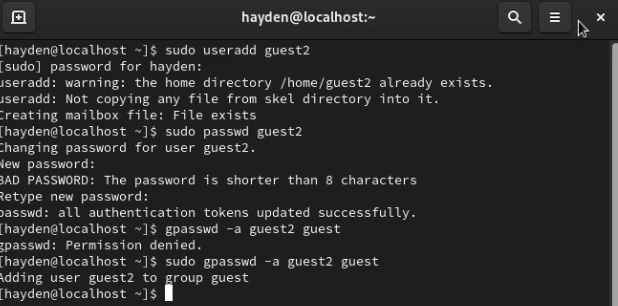
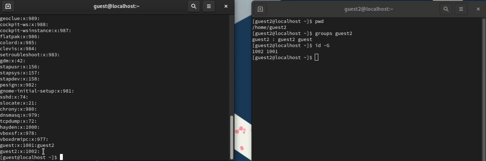
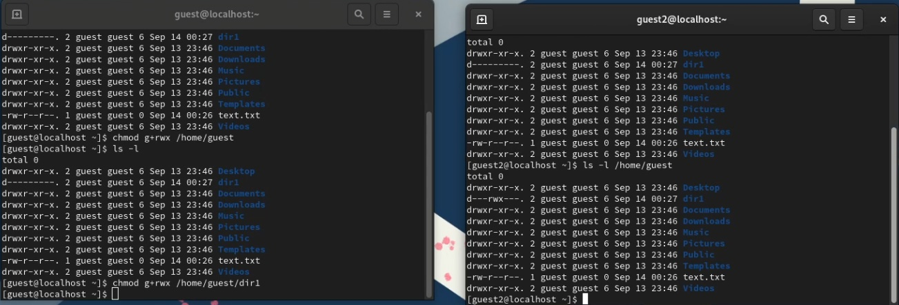

---
## Front matter
lang: ru-RU
title: "Основы информационной безопасности"
subtitle: "Лабораторная работа № 2. Дискреционное разграничение прав в Linux. Основные атрибуты"
author: |
	Подлесный Иван Сергеевич.
institute: Российский Университет дружбы народов
date: 14.09.2024

## i18n babel
babel-lang: russian
babel-otherlangs: english

## Formatting pdf
toc: false
toc-title: Содержание
slide_level: 2
aspectratio: 169
section-titles: true
theme: metropolis
header-includes:
 - \metroset{progressbar=frametitle,sectionpage=progressbar,numbering=fraction}
 - '\makeatletter'
 - '\beamer@ignorenonframefalse'
 - '\makeatother'
---

# Информация

## Докладчик

  * Подлесный Иван Сергеевич
  * студент группы НКНбд-01-21
  * Российский университет дружбы народов

# Вводная часть

## Цель Работы
Получение практических навыков работы в консоли с атрибутами файлов для групп пользователей.

# Ход работы

## Шаги 1-2

 Выполняем шаги 1-2:
  В установленной операционной системе создайте учётную запись пользователя guest(рис. @fig:001)

{#fig:001 width=70%}

## Шаги 3-4

В установленной при выполнении предыдущей лабораторной работы ОС создадим учетную запись ползователя guest2 и добавляем его в группу guest(рис. @fig:002)

{#fig:002 width=70%}

## Шаги 5-7

Осуществим вход в систему от двух пользователей на двух разных консолях: guest на первой консоли и guest2 на второй консоли.

{#fig:003 width=70%}

## Выполняем шаги 8-11:

Посмотрев информацию о группа этих пользователей в файле `/etc/group` получим аналогичную информацию(рис. @fig:004)

От имени пользователя guest2 выполните регистрацию пользователя guest2 в группе guest командой `newgrp guest`.

{#fig:004 width=70%}

## Выполняем шаг 12:

От имени пользователя guest изменим права директории /home/guest, разрешив все действия для пользователей группы и снимем с директории /home/guest/dir1 все атрибуты, затем проверим правильность атрибутов(рис. @fig:005).

{#fig:005 width=70%}

## Шаг 13:
В таблице приведены данные о том, какие операции разрешены, а какие нет для владельца данных.

Минимальные права для совершения операций 

| Операция | Минимальные права на директорию | Минимальные права на файл |
|-----------------------|------------|-----------|
|Создание файла|            d(030)               |               (000)            |
|Удаление файла|            d(030)               |               (000)            |
|Чтение файла|            d(010)               |               (040)            |
|Запись в файл|            d(010)               |               (020)            |
|Переименование файла |            d(030)               |               (000)            |
|Создание поддиректории |            d(030)               |               (000)            |
|Удаление поддиректории |            d(030)               |               (000)            |
# Заключение

## Выводы
В результате выполнения работы были приобретены практические навыки работы в консоли с атрибутами файлов для групп пользователей.

