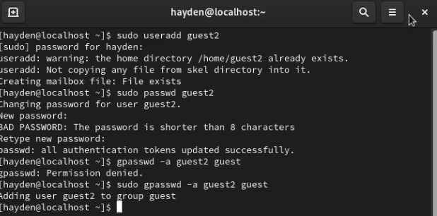
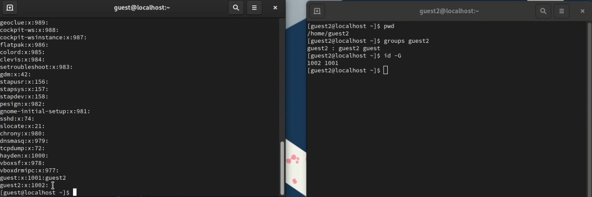
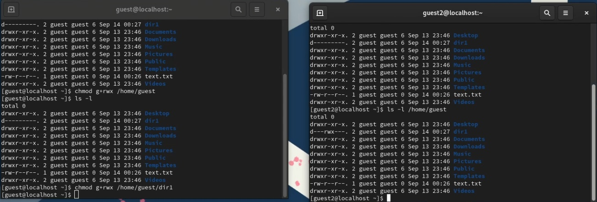

---
## Front matter
title: "Основы информационной безопасности"
subtitle: "Лабораторная работа № 3. Дискреционное разграничение прав в Linux. Два пользователя"
author: "Подлесный Иван Сергеевич"

## Generic otions
lang: ru-RU
toc-title: "Содержание"

## Bibliography
bibliography: bib/cite.bib
csl: pandoc/csl/gost-r-7-0-5-2008-numeric.csl

## Pdf output format
toc: true # Table of contents
toc-depth: 2
lof: true # List of figures
lot: false # List of tables
fontsize: 12pt
linestretch: 1.5
papersize: a4
documentclass: scrreprt
## I18n polyglossia
polyglossia-lang:
  name: russian
  options:
	- spelling=modern
	- babelshorthands=true
polyglossia-otherlangs:
  name: english
## I18n babel
babel-lang: russian
babel-otherlangs: english
## Fonts
mainfont: PT Serif
romanfont: PT Serif
sansfont: PT Sans
monofont: PT Mono
mainfontoptions: Ligatures=TeX
romanfontoptions: Ligatures=TeX
sansfontoptions: Ligatures=TeX,Scale=MatchLowercase
monofontoptions: Scale=MatchLowercase,Scale=0.9
## Biblatex
biblatex: true
biblio-style: "gost-numeric"
biblatexoptions:
  - parentracker=true
  - backend=biber
  - hyperref=auto
  - language=auto
  - autolang=other*
  - citestyle=gost-numeric
## Pandoc-crossref LaTeX customization
figureTitle: "Рис."
tableTitle: "Таблица"
listingTitle: "Листинг"
lofTitle: "Список иллюстраций"
lotTitle: "Список таблиц"
lolTitle: "Листинги"
## Misc options
indent: true
header-includes:
  - \usepackage{indentfirst}
  - \usepackage{float} # keep figures where there are in the text
  - \floatplacement{figure}{H} # keep figures where there are in the text
---

# Цель работы

Получение практических навыков работы в консоли с атрибутами файлов для групп пользователей.

# Выполнение лабораторной работы

В установленной операционной системе создайте учётную запись пользователя guest(рис. @fig:001)

{#fig:001 width=70%}

В установленной при выполнении предыдущей лабораторной работы ОС создадим учетную запись ползователя guest2 и добавляем его в группу guest(рис. @fig:002)

{#fig:002 width=70%}

Осуществим вход в систему от двух пользователей на двух разных консолях: guest на первой консоли и guest2 на второй консоли. Для обоих пользователей командой pwd определим директорию, в которой находимся, увидим, что она совпадает с приглашениями командной строки. Уточните имя нашего пользователя, его группу, кто входит в неё и к каким группам принадлежит он сам. Определим командами groups guest и groups guest2, в какие группы входят пользователи guest и guest2. Увидим, что guest принадлежит одной группе guet c ig 2001, а двум группам guest и guest2 с id 1001 и 1002. С помощью команд id -Gn и id -G можно увидеть только id существующиз групп и название соответственно(рис. @fig:003)

{#fig:003 width=70%}

Посмотрев информацию о группа этих пользователей в файле `/etc/group` получим аналогичную информацию(рис. @fig:004)

От имени пользователя guest2 выполните регистрацию пользователя guest2 в группе guest командой `newgrp guest`.

{#fig:004 width=70%}

От имени пользователя guest изменим права директории /home/guest, разрешив все действия для пользователей группы и снимем с директории /home/guest/dir1 все атрибуты, затем проверим правильность атрибутов(рис. @fig:005).

{#fig:005 width=70%}

В таблице приведены данные о том, какие операции разрешены, а какие нет для владельца данных.

Минимальные права для совершения операций 

| Операция | Минимальные права на директорию | Минимальные права на файл |
|-----------------------|------------|-----------|
|Создание файла|            d(030)               |               (000)            |
|Удаление файла|            d(030)               |               (000)            |
|Чтение файла|            d(010)               |               (040)            |
|Запись в файл|            d(010)               |               (020)            |
|Переименование файла |            d(030)               |               (000)            |
|Создание поддиректории |            d(030)               |               (000)            |
|Удаление поддиректории |            d(030)               |               (000)            |

При сравнении с таблицей в лабораторной работе №2 можно увидеть, что отличие состоит только в том, что не владелец файла никогда не имеет прав на изменение его атрибутов. Менять права доступа (записывать в inode) может владелец файла или администратор. Члены группы файла никаких особых прав на inode не имеют. Пользователь может отобрать у себя собственные права на чтение и запись в файл, но право на запись в inode (в т.ч. право на смену прав) сохраняется у владельца файла при любых обстоятельствах. Пользователь не может передать право собственности на файл другому пользователю и не может забрать право собственности на файл у другого пользователя.

# Выводы

В результате выполнения работы были приобретены практические навыки работы в консоли с атрибутами файлов для групп пользователей.

