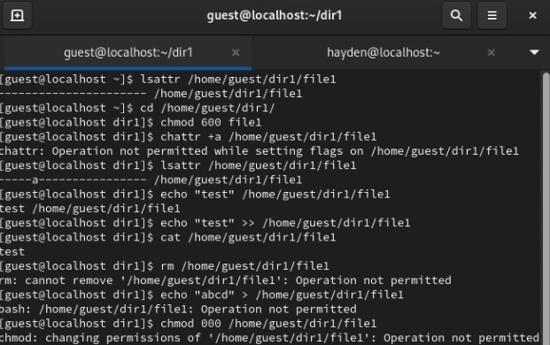
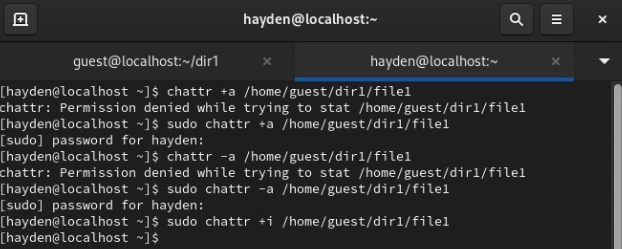
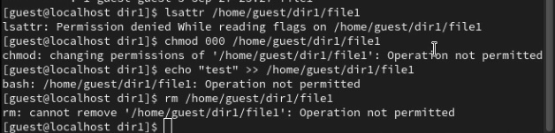

---
## Front matter
lang: ru-RU
title: "Основы информационной безопасности"
subtitle: "Лабораторная работа № 4. Дискреционное разграничение прав в Linux. Основные атрибуты"
author: |
	Подлесный Иван Сергеевич.
institute: Российский Университет дружбы народов
date: 14.09.2024

## i18n babel
babel-lang: russian
babel-otherlangs: english

## Formatting pdf
toc: false
toc-title: Содержание
slide_level: 2
aspectratio: 169
section-titles: true
theme: metropolis
header-includes:
 - \metroset{progressbar=frametitle,sectionpage=progressbar,numbering=fraction}
 - '\makeatletter'
 - '\beamer@ignorenonframefalse'
 - '\makeatother'
---

# Информация

## Докладчик

  * Подлесный Иван Сергеевич
  * студент группы НКНбд-01-21
  * Российский университет дружбы народов

# Вводная часть

## Цель Работы
Получение практических навыков работы в консоли с атрибутами файлов для групп пользователей.

# Ход работы

## Шаги 1-3

От имени пользователя guest определил расширенные атрибуты файла
/home/guest/dir1/file1 командой "lsattr /home/guest/dir1/file1"(рис. @fig:001)

Установить командой "chmod 600 file1" права, разрешающие чтение и запись для владельца файла.

Попробовал установить на файл /home/guest/dir1/file1 расширенный атрибут a от имени пользователя guest: "chattr +a /home/guest/dir1/file1" -- получен отказ.

{#fig:001 width=70%}

## Шаг 4

Зайшел в консоль с правами администратора и попробовал установить расширенный атрибут a на файл /home/guest/dir1/file1 от имени суперпользователя:(рис. @fig:002)

{#fig:002 width=70%}

## Шаги 5

От пользователя guest проверьте правильность установления атрибута: lsattr /home/guest/dir1/file1(рис. @fig:003)

{#fig:003 width=70%}
## Выполняем шаги 6

Выполнил дозапись в файл file1 слова «test» командой
"echo "test" /home/guest/dir1/file1" После этого выполнил чтение файла file1 командой
"cat /home/guest/dir1/file1"(рис. @fig:004)

{#fig:004 width=70%}

## Выполняем шаг 7-8:

Попробуйте удалить файл file1 либо стереть имеющуюся в нём информацию командой
echo "abcd" > /home/guest/dirl/file1(рис. @fig:005)

{#fig:005 width=70%}

Попробовал с помощью команды "chmod 000 file1" установить на файл file1 права, например, запрещающие чтение и запись для владельца файла  -- получен отказ.

## Шаг 9:
нял расширенный атрибут a с файла /home/guest/dirl/file1 от имени суперпользователя командой "chattr -a /home/guest/dir1/file1" и повторил операции, которые ранее не удавалось выполнить. Ваши наблюдения занесите в отчёт(рис. @fig:006)

{#fig:006 width=70%}

## Шаг 10:

Повторите ваши действия по шагам, заменив атрибут «a» атрибутом «i».
Удалось ли вам дозаписать информацию в файл? Ваши наблюдения занесите в отчёт.(рис. @fig:007)

{#fig:007 width=70%}

# Заключение

## Выводы
В результате выполнения работы были приобретены практические навыки работы в консоли с раширенными атрибутами файлов.

