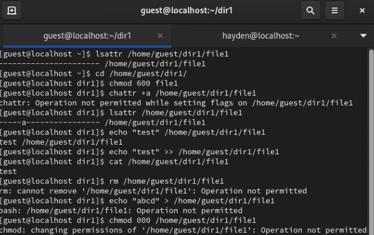
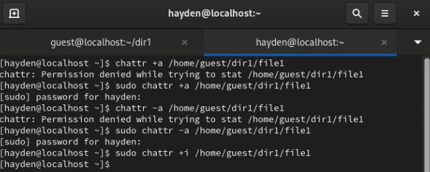
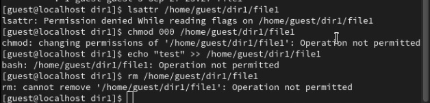

---
## Front matter
title: "Основы информационной безопасности"
subtitle: "Лабораторная работа № 4. Дискреционное разграничение прав в Linux. Два пользователя"
author: "Подлесный Иван Сергеевич"

## Generic otions
lang: ru-RU
toc-title: "Содержание"

## Bibliography

## Pdf output format
toc: true # Table of contents
toc-depth: 2
lof: true # List of figures
lot: false # List of tables
fontsize: 12pt
linestretch: 1.5
papersize: a4
documentclass: scrreprt
## I18n polyglossia
polyglossia-lang:
  name: russian
  options:
	- spelling=modern
	- babelshorthands=true
polyglossia-otherlangs:
  name: english
## I18n babel
babel-lang: russian
babel-otherlangs: english
## Fonts
mainfont: PT Serif
romanfont: PT Serif
sansfont: PT Sans
monofont: PT Mono
mainfontoptions: Ligatures=TeX
romanfontoptions: Ligatures=TeX
sansfontoptions: Ligatures=TeX,Scale=MatchLowercase
monofontoptions: Scale=MatchLowercase,Scale=0.9
## Biblatex
biblatex: true
biblio-style: "gost-numeric"
biblatexoptions:
  - parentracker=true
  - backend=biber
  - hyperref=auto
  - language=auto
  - autolang=other*
  - citestyle=gost-numeric
## Pandoc-crossref LaTeX customization
figureTitle: "Рис."
tableTitle: "Таблица"
listingTitle: "Листинг"
lofTitle: "Список иллюстраций"
lotTitle: "Список таблиц"
lolTitle: "Листинги"
## Misc options
indent: true
header-includes:
  - \usepackage{indentfirst}
  - \usepackage{float} # keep figures where there are in the text
  - \floatplacement{figure}{H} # keep figures where there are in the text
---

# Цель работы

Получение практических навыков работы в консоли с атрибутами файлов для групп пользователей.

# Выполнение лабораторной работы

От имени пользователя guest определил расширенные атрибуты файла
/home/guest/dir1/file1 командой "lsattr /home/guest/dir1/file1"(рис. @fig:001)

{#fig:001 width=70%}

Установить командой "chmod 600 file1" права, разрешающие чтение и запись для владельца файла.

Попробовал установить на файл /home/guest/dir1/file1 расширенный атрибут a от имени пользователя guest: "chattr +a /home/guest/dir1/file1" -- получен отказ.

Зайшел в консоль с правами администратора и попробовал установить расширенный атрибут a на файл /home/guest/dir1/file1 от имени суперпользователя:(рис. @fig:002)

{#fig:002 width=70%}

От пользователя guest проверьте правильность установления атрибута:
lsattr /home/guest/dir1/file1(рис. @fig:003)

{#fig:003 width=70%}

Выполнил дозапись в файл file1 слова «test» командой
"echo "test" /home/guest/dir1/file1" После этого выполнил чтение файла file1 командой
"cat /home/guest/dir1/file1"(рис. @fig:004)

{#fig:004 width=70%}

Попробуйте удалить файл file1 либо стереть имеющуюся в нём информацию командой
echo "abcd" > /home/guest/dirl/file1(рис. @fig:005)

{#fig:005 width=70%}

Попробовал с помощью команды "chmod 000 file1" установить на файл file1 права, например, запрещающие чтение и запись для владельца файла  -- получен отказ.

Снял расширенный атрибут a с файла /home/guest/dirl/file1 от имени суперпользователя командой "chattr -a /home/guest/dir1/file1" и повторил операции, которые ранее не удавалось выполнить. Ваши
наблюдения занесите в отчёт(рис. @fig:006)

{#fig:006 width=70%}

Повторите ваши действия по шагам, заменив атрибут «a» атрибутом «i».
Удалось ли вам дозаписать информацию в файл? Ваши наблюдения занесите в отчёт.(рис. @fig:007)

{#fig:007 width=70%}

# Выводы

В результате выполнения работы были приобретены практические навыки работы в консоли с раширенными атрибутами файлов.

