---
## Front matter
lang: ru-RU
title: "Основы информационной безопасности"
subtitle: "Лабораторная работа № 5. Дискреционное разграничение прав в Linux. Основные атрибуты"
author: |
	Подлесный Иван Сергеевич.
institute: Российский Университет дружбы народов
date: 14.09.2024

## i18n babel
babel-lang: russian
babel-otherlangs: english

## Formatting pdf
toc: false
toc-title: Содержание
slide_level: 2
aspectratio: 169
section-titles: true
theme: metropolis
header-includes:
 - \metroset{progressbar=frametitle,sectionpage=progressbar,numbering=fraction}
 - '\makeatletter'
 - '\beamer@ignorenonframefalse'
 - '\makeatother'
---

# Информация

## Докладчик

  * Подлесный Иван Сергеевич
  * студент группы НКНбд-01-21
  * Российский университет дружбы народов

# Вводная часть

## Цель Работы

Изучение механизмов изменения идентификаторов, применения SetUID- и Sticky-битов. Получение практических навыков работы в консоли с дополнительными атрибутами. Рассмотрение работы механизма смены идентификатора процессов пользователей, а также влияние бита Sticky на запись и удаление файлов.

# Ход работы

## Шаг 1

Проверим установлен ли компилятор gcc(обновим его), а также отключим SELinux(рис. @fig:001)

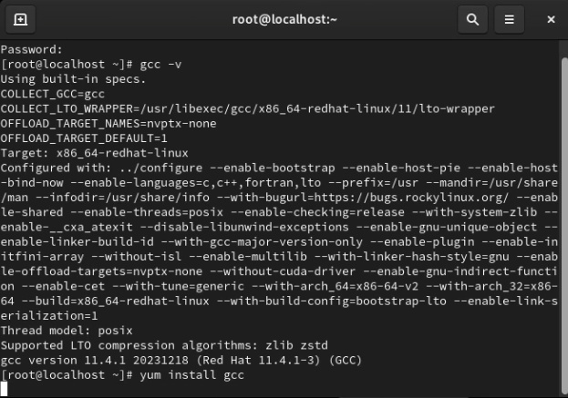{#fig:001 width=70%}

## Шаг 2

Войдем в систему от имени пользователя guest и создадим программу simpleid.c, которая выводит идентификатор пользователя и группы(рис. @fig:002)

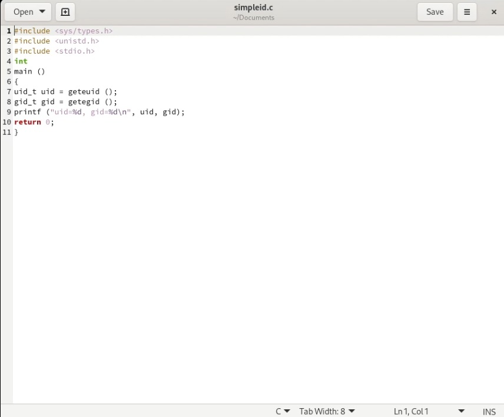{#fig:002 width=70%}

## Шаг 3

Запустив её, увидим, что она выводит идентификаторы пользователя и группы 1001 и 1001 для guest, что совпадает с выводом команды id(рис. @fig:003)

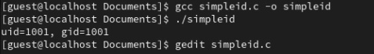{#fig:003 width=70%}

## Шаг 4

Изменим программу, добавив вывод действительных идентификаторов(рис. @fig:004).

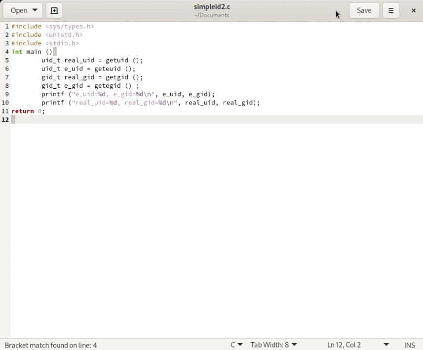{#fig:004 width=70%}

## Шаг 5

Компилириуем программу с помощью gcc, затем, запустив её, увидим, что она выводит идентификаторы пользователя и группы 1001 и 1001 для guest, что совпадает с выводом команды id(рис. @fig:005).

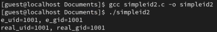{#fig:005 width=70%}

## Шаг 6

От имени суперпользователя изменим владельца файла homeguestsimpleid2 и установим SetUID-бит. Проверим корректность установленных прав и опять запустим simpleid2(рис. @fig:006).

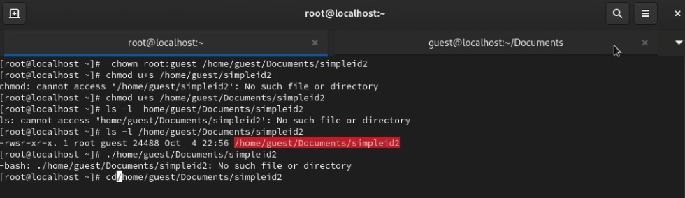{#fig:006 width=70%}

## Шаг 6

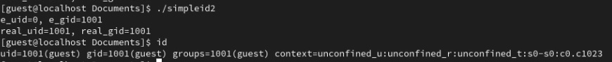{#fig:062 width=70%}

## Шаг 7
Проделаем аналогичные действия относительно SetGID-бита(рис. @fig:007):

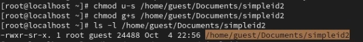{#fig:007 width=70%}

## Шаг 7

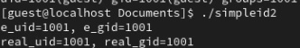{#fig:072 width=70%}

## Шаг 8

Создадим программу для чтения файлов readfile.c(рис. @fig:008):

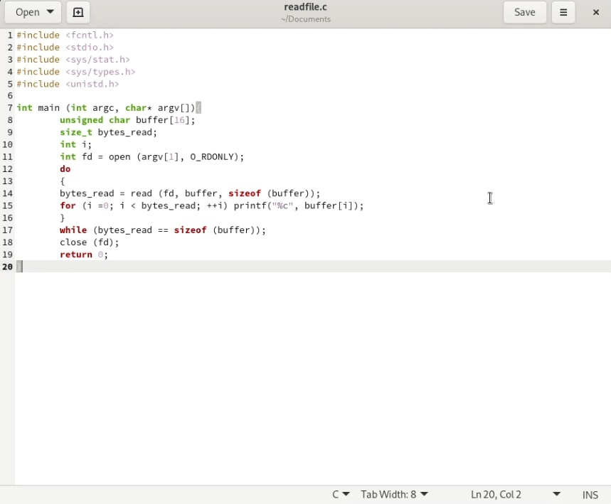{#fig:008 width=70%}

## Шаг 8

{#fig:082 width=70%}

## Шаг 9

Скомпилируем её и сменим владельца у файла с текстом программы, затем изменим права так, чтобы только суперпользователь (root) мог прочитать его, и проверим корректность настроек(рис. @fig:009):

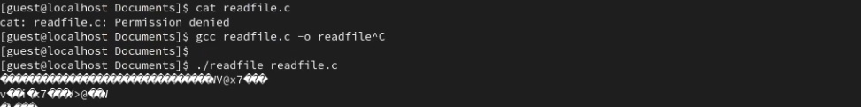{#fig:009 width=70%}

## Шаг 10

Сменим у программы readfile владельца и установим SetUID-бит. Теперь эта программа может прочитать файл readfile.c , также она может прочитать файл etcshadow, владельцем которого guest также не является, так как программа readfile теперь имеет все права пользователя root(рис. @fig:010):

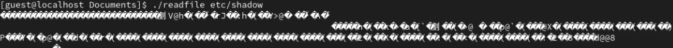{#fig:010 width=70%}

## Шаг 11
роверим, что установлен атрибут Sticky на директории tmp(в конце стоит t). Затем от имени пользователя guest создадим файл file01.txt в директории tmp со словом test, затем просмотрим атрибуты у только что созданного файла и разрешим чтение и запись для категории пользователей «все остальные».(рис. @fig:011)

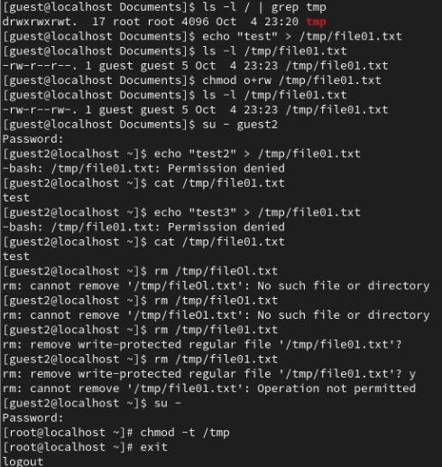{#fig:011 width=70%}

## Шаг 12

 После этого от пользователя guest2 попробуем дозаписать в этот файл новое слово, однако получим отказ, также нам отказано в перезаписи и удалении этого файла. Если же убрать Sticky бит, то нам будет разрешено удаление этого файла(рис. @fig:012):

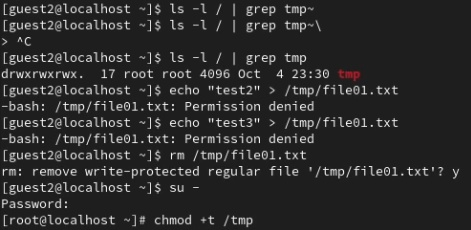{#fig:012 width=70%}

# Заключение

## Выводы

В результате выполнения работы были визучены механизмы изменения идентификаторов, применения SetUID- и Sticky-битов.

Были получены практических навыков работы в консоли с дополнительными атрибутами.

Были рассмотрены работы механизма смены идентификатора процессов пользователей, а также влияние бита Sticky на запись и удаление файлов.

