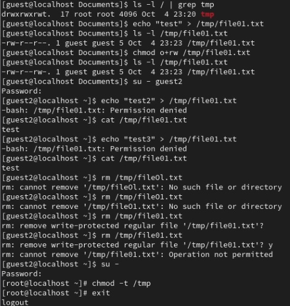

---
## Front matter
title: "Основы информационной безопасности"
subtitle: "Лабораторная работа № 5. Дискреционное разграничение прав в Linux. Два пользователя"
author: "Подлесный Иван Сергеевич"

## Generic otions
lang: ru-RU
toc-title: "Содержание"

## Bibliography

## Pdf output format
toc: true # Table of contents
toc-depth: 2
lof: true # List of figures
lot: false # List of tables
fontsize: 12pt
linestretch: 1.5
papersize: a4
documentclass: scrreprt
## I18n polyglossia
polyglossia-lang:
  name: russian
  options:
	- spelling=modern
	- babelshorthands=true
polyglossia-otherlangs:
  name: english
## I18n babel
babel-lang: russian
babel-otherlangs: english
## Fonts
mainfont: PT Serif
romanfont: PT Serif
sansfont: PT Sans
monofont: PT Mono
mainfontoptions: Ligatures=TeX
romanfontoptions: Ligatures=TeX
sansfontoptions: Ligatures=TeX,Scale=MatchLowercase
monofontoptions: Scale=MatchLowercase,Scale=0.9
## Biblatex
biblatex: true
biblio-style: "gost-numeric"
biblatexoptions:
  - parentracker=true
  - backend=biber
  - hyperref=auto
  - language=auto
  - autolang=other*
  - citestyle=gost-numeric
## Pandoc-crossref LaTeX customization
figureTitle: "Рис."
tableTitle: "Таблица"
listingTitle: "Листинг"
lofTitle: "Список иллюстраций"
lotTitle: "Список таблиц"
lolTitle: "Листинги"
## Misc options
indent: true
header-includes:
  - \usepackage{indentfirst}
  - \usepackage{float} # keep figures where there are in the text
  - \floatplacement{figure}{H} # keep figures where there are in the text
---

# Цель работы

Изучение механизмов изменения идентификаторов, применения SetUID- и Sticky-битов. Получение практических навыков работы в консоли с дополнительными атрибутами. Рассмотрение работы механизма смены идентификатора процессов пользователей, а также влияние бита Sticky на запись и удаление файлов.

# Выполнение лабораторной работы

Проверим установлен ли компилятор gcc(обновим его), а также отключим SELinux(рис. @fig:001)

{#fig:001 width=70%}

Войдем в систему от имени пользователя guest и создадим программу simpleid.c, которая выводит идентификатор пользователя и группы(рис. @fig:002)

{#fig:002 width=70%}

Запустив её, увидим, что она выводит идентификаторы пользователя и группы 1001 и 1001 для guest, что совпадает с выводом команды id(рис. @fig:003)

{#fig:003 width=70%}

Изменим программу, добавив вывод действительных идентификаторов(рис. @fig:004).

{#fig:004 width=70%}

Компилириуем программу с помощью gcc, затем, запустив её, увидим, что она выводит идентификаторы пользователя и группы 1001 и 1001 для guest, что совпадает с выводом команды id(рис. @fig:005).

{#fig:005 width=70%}

От имени суперпользователя изменим владельца файла homeguestsimpleid2 и установим SetUID-бит. Проверим корректность установленных прав и опять запустим simpleid2(рис. @fig:006).

{#fig:006 width=70%}

{#fig:062 width=70%}

Проделаем аналогичные действия относительно SetGID-бита(рис. @fig:007):

{#fig:007 width=70%}
{#fig:072 width=70%}

Создадим программу для чтения файлов readfile.c(рис. @fig:008):

{#fig:008 width=70%}

{#fig:082 width=70%}

Скомпилируем её и сменим владельца у файла с текстом программы, затем изменим права так, чтобы только суперпользователь (root) мог прочитать его, и проверим корректность настроек(рис. @fig:009):

{#fig:009 width=70%}

Сменим у программы readfile владельца и установим SetUID-бит. Теперь эта программа может прочитать файл readfile.c , также она может прочитать файл etcshadow, владельцем которого guest также не является, так как программа readfile теперь имеет все права пользователя root(рис. @fig:010):

{#fig:010 width=70%}

Проверим, что установлен атрибут Sticky на директории tmp(в конце стоит t). Затем от имени пользователя guest создадим файл file01.txt в директории tmp со словом test, затем просмотрим атрибуты у только что созданного файла и разрешим чтение и запись для категории пользователей «все остальные». После этого от пользователя guest2 попробуем дозаписать в этот файл новое слово, однако получим отказ, также нам отказано в перезаписи и удалении этого файла. Если же убрать Sticky бит, то нам будет разрешено удаление этого файла(рис. @fig:011):

{#fig:011 width=70%}

{#fig:012 width=70%}

# Выводы

В результате выполнения работы были визучены механизмы изменения идентификаторов, применения SetUID- и Sticky-битов.

Были получены практических навыков работы в консоли с дополнительными атрибутами.

Были рассмотрены работы механизма смены идентификатора процессов пользователей, а также влияние бита Sticky на запись и удаление файлов.

