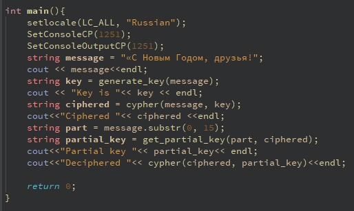
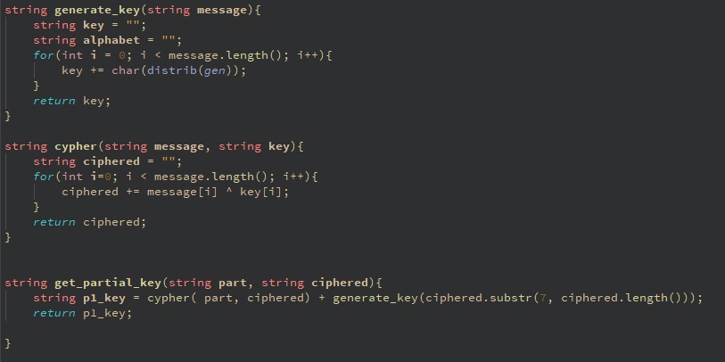
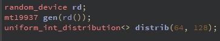
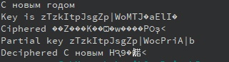

---
## Front matter
lang: ru-RU
title: "Основы информационной безопасности"
subtitle: "Лабораторная работа № 7.  Элементы криптографии и однократное гаммирование"
author: "Подлесный Иван Сергеевич"
institute: Российский Университет дружбы народов
date: 14.09.2024

## i18n babel
babel-lang: russian
babel-otherlangs: english

## Formatting pdf
toc: false
toc-title: Содержание
slide_level: 2
aspectratio: 169
section-titles: true
theme: metropolis
header-includes:
 - \metroset{progressbar=frametitle,sectionpage=progressbar,numbering=fraction}
---

# Информация

## Докладчик

  * Подлесный Иван Сергеевич
  * студент группы НКНбд-01-21
  * Российский университет дружбы народов

# Вводная часть

# Цель работы

Освоить на практике применение режима однократного гаммирования

# Задание 

Нужно подобрать ключ, чтобы получить сообщение «С Новым Годом, друзья!». Требуется разработать приложение, позволяющее шифровать и дешифровать данные в режиме однократного гаммирования. Приложение должно:

1. Определить вид шифротекста при известном ключе и известном открытом тексте.
2. Определить ключ, с помощью которого шифротекст может быть преобразован в некоторый фрагмент текста, представляющий собой один из возможных вариантов прочтения открытого текста.

# Выполнение лабораторной работы

## Определим фунцию выбора случайных чисел

{#fig:001 width=70%}

## Напишем фунции генерации ключа и шифрования

{#fig:002 width=70%}

## Напишем вызовы из главной части кода

{#fig:003 width=70%}

## Запускаем программу

{#fig:004 width=70%}

# Выводы

В результате выполнения работы были освоены практические навыки применения режима однократного гаммирования.
