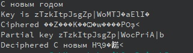

---
## Front matter
title: "Основы информационной безопасности"
subtitle: "Лабораторная работа № 7.  Элементы криптографии и однократное гаммирование"
author: "Подлесный Иван Сергеевич"
## Generic otions
lang: ru-RU
toc-title: "Содержание"
## Pdf output format
toc: true # Table of contents
toc-depth: 2
lof: true # List of figures
lot: false # List of tables
fontsize: 12pt
linestretch: 1.5
papersize: a4
documentclass: scrreprt
## I18n polyglossia
polyglossia-lang:
  name: russian
  options:
	- spelling=modern
	- babelshorthands=true
polyglossia-otherlangs:
  name: english
## I18n babel
babel-lang: russian
babel-otherlangs: english
## Fonts
mainfont: PT Serif
romanfont: PT Serif
sansfont: PT Sans
monofont: PT Mono
mainfontoptions: Ligatures=TeX
romanfontoptions: Ligatures=TeX
sansfontoptions: Ligatures=TeX,Scale=MatchLowercase
monofontoptions: Scale=MatchLowercase,Scale=0.9
## Biblatex
biblatex: true
biblio-style: "gost-numeric"
biblatexoptions:
  - parentracker=true
  - backend=biber
  - hyperref=auto
  - language=auto
  - autolang=other*
  - citestyle=gost-numeric
## Pandoc-crossref LaTeX customization
figureTitle: "Рис."
tableTitle: "Таблица"
listingTitle: "Листинг"
lofTitle: "Список иллюстраций"
lotTitle: "Список таблиц"
lolTitle: "Листинги"
## Misc options
indent: true
header-includes:
  - \usepackage[T1]{fontenc}
  - \usepackage{lmodern}
  - \usepackage[utf8]{inputenx}
  - \input{ix-utf8enc.dfu}
  - \usepackage[T2A]{fontenc}
  - \usepackage{indentfirst}
  - \usepackage{float} # keep figures where there are in the text
  - \floatplacement{figure}{H} # keep figures where there are in the text
---
# Цель работы

Освоить на практике применение режима однократного гаммирования

# Задание 

Нужно подобрать ключ, чтобы получить сообщение «С Новым Годом, друзья!». Требуется разработать приложение, позволяющее шифровать и дешифровать данные в режиме однократного гаммирования. Приложение должно:

1. Определить вид шифротекста при известном ключе и известном открытом тексте.
2. Определить ключ, с помощью которого шифротекст может быть преобразован в некоторый фрагмент текста, представляющий собой один из возможных вариантов прочтения открытого текста.


# Выполнение лабораторной работы

Создадим функцию `generate_key` которая будет генерировать случайный ключа(составляется выбором из букв Латиницы больших и спецсимволов ), `cypher` -- принимает на вход текст и ключ, а затем осуществляет посимвольное сложение по модулю 2, ` get_partial_key` -- подбирает точную часть ключа для известного фрагмента сообщения, а затем оставшуюся часть выбирает случайным образом:


```c++
#include <iostream>
#include <cstring>
#include <string>
#include <windows.h>
#include <random>
using namespace std;

random_device rd;
mt19937 gen(rd());
uniform_int_distribution<> distrib(64, 128);


string generate_key(string message){
    string key = "";
    string alphabet = "";
    for(int i = 0; i < message.length(); i++){
        key += char(distrib(gen));
    }
    return key;
}

string cypher(string message, string key){
    string ciphered = "";
    for(int i=0; i < message.length(); i++){
        ciphered += message[i] ^ key[i];
    }
    return ciphered;
}


string get_partial_key(string part, string ciphered){
    string p1_key = cypher( part, ciphered) + generate_key(ciphered.substr(7, ciphered.length()));
    return p1_key;

}

int main(){
    setlocale(LC_ALL, "Russian");
    SetConsoleCP(1251);
    SetConsoleOutputCP(1251);
    string message = "«С Новым Годом, друзья!";
    cout << message<<endl;
    string key = generate_key(message);
    cout << "Key is "<< key << endl;
    string ciphered = cypher(message, key);
    cout<<"Ciphered "<< ciphered <<endl;
    string part = message.substr(0, 15);
    string partial_key = get_partial_key(part, ciphered);
    cout<<"Partial key "<< partial_key<< endl;
    cout<<"Deciphered "<< cypher(ciphered, partial_key)<<endl;

    return 0;
}


```
В результате получим следующий вариант шифрования и один из вариантов прочтения текста(рис. @fig:001)

{#fig:001 width=70%}

# Контрольные вопросы

1. Поясните смысл однократного гаммирования.

Гаммиирование, или Шифр XOR, — метод симметричного шифрования, заключающийся в «наложении» последовательности, состоящей из случайных чисел, на открытый текст.
Если в методе шифрования используется однократная вероятностная гамма (однократное гаммирование) той же длины, что и подлежащий сокрытию текст, то текст нельзя раскрыть.

2. Перечислите недостатки однократного гаммирования.

- Если один и тот же ключ используется для шифрования нескольких сообщений, это может привести к уязвимостям. Например, если злоумышленник узнает открытый текст и соответствующий шифротекст, он может использовать эту информацию для взлома ключа.
- Однократное гаммирование не обеспечивает аутентификацию или целостность данных. Это означает, что злоумышленник может изменить шифротекст без заметных изменений в открытом тексте.

3. Перечислите преимущества однократного гаммирования.

- Однократное гаммирование обеспечивает высокий уровень конфиденциальности, поскольку шифротекст не может быть легко взломан без знания ключа.
- Однократное гаммирование обеспечивает равномерное распределение вероятностей для каждого символа в шифротексте, что делает его статистически неразличимым от случайной последовательности.
- Однократное гаммирование является простым и быстрым методом шифрования.

4. Почему длина открытого текста должна совпадать с длиной ключа?

Если в методе шифрования используется однократная вероятностная гамма (однократное гаммирование) той же длины, что и подлежащий сокрытию текст, то текст нельзя раскрыть.
   
5. Какая операция используется в режиме однократного гаммирования, назовите её особенности?

В режиме однократного гаммирования используется операция XOR (исключающее ИЛИ). Особенностью операции XOR является то, что она возвращает 1 только в том случае, если один из входных битов равен 1, но не оба.

6. Как по открытому тексту и ключу получить шифротекст?

Нужно побитово сложить по модулю численное представление символов в ключе и в открытом тексте.

7. Как по открытому тексту и шифротексту получить ключ?

Нужно побитово сложить по модулю численное представление символов в шифротексте и в открытом тексте.

8. В чем заключаются необходимые и достаточные условия абсолютной стойкости шифра?

Необходимые и достаточные условия абсолютной стойкости шифра:

 - Ключ является фрагментом истинно случайной двоичной последовательности с равномерным законом распределения.

 - Длины ключа и открытого текста совпадают.

 - Ключ используется лишь один раз, после чего сразу подлежит уничтожению.

# Выводы

В результате выполнения работы были освоены практические навыки применения режима однократного гаммирования.


