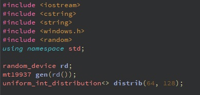
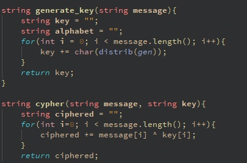
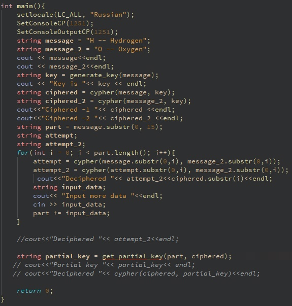
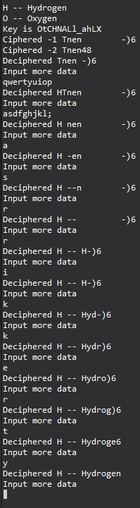

---
## Front matter
lang: ru-RU
title: "Основы информационной безопасности"
subtitle: "Лабораторная работа № 7.  Элементы криптографии и однократное гаммирование"
author: "Подлесный Иван Сергеевич"
institute: Российский Университет дружбы народов
date: 14.09.2024

## i18n babel
babel-lang: russian
babel-otherlangs: english

## Formatting pdf
toc: false
toc-title: Содержание
slide_level: 2
aspectratio: 169
section-titles: true
theme: metropolis
header-includes:
- \usepackage{lmodern}
- \usepackage[utf8]{inputenx}
- \input{ix-utf8enc.dfu}
- \usepackage[T2A]{fontenc}
- \usepackage{indentfirst}
- \usepackage{float} # keep figures where there are in the text
- \floatplacement{figure}{H} # keep figures where there are in the text

---

# Информация

## Докладчик

  * Подлесный Иван Сергеевич
  * студент группы НКНбд-01-21
  * Российский университет дружбы народов

# Вводная часть

# Цель работы

Освоить на практике применение режима однократного гаммирования

# Задание 

Освоить на практике применение режима однократного гаммирования на примере кодирования различных исходных текстов одним ключом

# Выполнение лабораторной работы

## Определим фунцию выбора случайных чисел

{#fig:001 width=70%}

## Напишем фунции генерации ключа и шифрования
Создадим функцию `generate_key` которая будет генерировать случайный ключа(составляется выбором из букв Латиницы больших и спецсимволов ), `cypher` -- принимает на вход текст и ключ, а затем осуществляет посимвольное сложение по модулю 2.

{#fig:002 width=70%}

## Напишем вызовы из главной части кода

Опишем случай, когда злоумышленник может прочитать оба текста, не зная ключа и не стремясь его определить. Предположим, что одна из телеграмм является шаблоном -- т.е. имеет текст фиксированный формат, в который вписываются значения полей. Допустим, что злоумышленнику этот формат известен. Тогда он получает достаточно много пар $C1 \oplus C2$ (известен вид обеих шифровок). Тогда зная P1 имеем:

$$
C1 \oplus C2 \oplus P1 = P1 \oplus P2 \oplus P1 = P2. 
$$

{#fig:003 width=70%}

## Запускаем программу

Проиллюстрируем этот процесс на практике.
Применим наши функции к заданному сообщению. Допустим нам известна часть второго сообщения. В цикле `for` в интерактивном режиме будет отгадывать части сообщений, пока не угадаем их полностью:

{#fig:004 width=70%}

# Выводы

В результате выполнения работы были освоены практические навыки применения режима однократного гаммирования.
