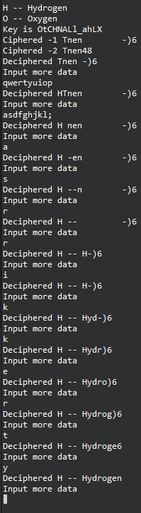

---
## Front matter
title: "Основы информационной безопасности"
subtitle: "Лабораторная работа № 7.  Элементы криптографии и однократное гаммирование"
author: "Подлесный Иван Сергеевич"
## Generic otions
lang: ru-RU
toc-title: "Содержание"
## Pdf output format
toc: true # Table of contents
toc-depth: 2
lof: true # List of figures
lot: false # List of tables
fontsize: 12pt
linestretch: 1.5
papersize: a4
documentclass: scrreprt
## I18n polyglossia
polyglossia-lang:
  name: russian
  options:
	- spelling=modern
	- babelshorthands=true
polyglossia-otherlangs:
  name: english
## I18n babel
babel-lang: russian
babel-otherlangs: english
## Fonts
mainfont: PT Serif
romanfont: PT Serif
sansfont: PT Sans
monofont: PT Mono
mainfontoptions: Ligatures=TeX
romanfontoptions: Ligatures=TeX
sansfontoptions: Ligatures=TeX,Scale=MatchLowercase
monofontoptions: Scale=MatchLowercase,Scale=0.9
## Biblatex
biblatex: true
biblio-style: "gost-numeric"
biblatexoptions:
  - parentracker=true
  - backend=biber
  - hyperref=auto
  - language=auto
  - autolang=other*
  - citestyle=gost-numeric
## Pandoc-crossref LaTeX customization
figureTitle: "Рис."
tableTitle: "Таблица"
listingTitle: "Листинг"
lofTitle: "Список иллюстраций"
lotTitle: "Список таблиц"
lolTitle: "Листинги"
## Misc options
indent: true
header-includes:
  - \usepackage[T1]{fontenc}
  - \usepackage{lmodern}
  - \usepackage[utf8]{inputenx}
  - \input{ix-utf8enc.dfu}
  - \usepackage[T2A]{fontenc}
  - \usepackage{indentfirst}
  - \usepackage{float} # keep figures where there are in the text
  - \floatplacement{figure}{H} # keep figures where there are in the text
---
# Цель работы

Освоить на практике применение режима однократного гаммирования

# Задание 

Нужно подобрать ключ, чтобы получить сообщение «С Новым Годом, друзья!». Требуется разработать приложение, позволяющее шифровать и дешифровать данные в режиме однократного гаммирования. Приложение должно:

1. Определить вид шифротекста при известном ключе и известном открытом тексте.
2. Определить ключ, с помощью которого шифротекст может быть преобразован в некоторый фрагмент текста, представляющий собой один из возможных вариантов прочтения открытого текста.


# Выполнение лабораторной работы

Создадим функцию `generate_key` которая будет генерировать случайный ключа(составляется выбором из букв Латиницы больших и спецсимволов ), `cypher` -- принимает на вход текст и ключ, а затем осуществляет посимвольное сложение по модулю 2.
Опишем случай, когда злоумышленник может прочитать оба текста, не зная ключа и не стремясь его определить. Предположим, что одна из телеграмм является шаблоном -- т.е. имеет текст фиксированный формат, в который вписываются значения полей. Допустим, что злоумышленнику этот формат известен. Тогда он получает достаточно много пар $C1 \oplus C2$ (известен вид обеих шифровок). Тогда зная P1 имеем:

$$
C1 \oplus C2 \oplus P1 = P1 \oplus P2 \oplus P1 = P2. 
$$

Проиллюстрируем этот процесс на практике.
Применим наши функции к заданному сообщению. Допустим нам известна часть второго сообщения. В цикле `for` в интерактивном режиме будет отгадывать части сообщений, пока не угадаем их полностью:


```c++
#include <iostream>
#include <cstring>
#include <string>
#include <windows.h>
#include <random>
using namespace std;

random_device rd;
mt19937 gen(rd());
uniform_int_distribution<> distrib(64, 128);


string generate_key(string message){
    string key = "";
    string alphabet = "";
    for(int i = 0; i < message.length(); i++){
        key += char(distrib(gen));
    }
    return key;
}

string cypher(string message, string key){
    string ciphered = "";
    for(int i=0; i < message.length(); i++){
        ciphered += message[i] ^ key[i];
    }
    return ciphered;
}


int main(){
    setlocale(LC_ALL, "Russian");
    SetConsoleCP(1251);
    SetConsoleOutputCP(1251);
    string message = "H -- Hydrogen";
    string message_2 = "O -- Oxygen";
    cout << message<<endl;
    cout << message_2<<endl;
    string key = generate_key(message);
    cout << "Key is "<< key << endl;
    string ciphered = cypher(message, key);
    string ciphered_2 = cypher(message_2, key);
    cout<<"Ciphered -1 "<< ciphered <<endl;
    cout<<"Ciphered -2 "<< ciphered_2 <<endl;
    string part = message.substr(0, 15);
    string attempt;
    string attempt_2;
    for(int i = 0; i < part.length(); i++){
        attempt = cypher(message.substr(0,i), message_2.substr(0,i));
        attempt_2 = cypher(attempt.substr(0,i), message_2.substr(0,i));
         cout<<"Deciphered "<< attempt_2<<ciphered.substr(i)<<endl;
        string input_data;
        cout<< "Input more data "<<endl;
        cin >> input_data;
        part += input_data;
    }

    //cout<<"Deciphered "<< attempt_2<<endl;

    string partial_key = get_partial_key(part, ciphered);
   // cout<<"Partial key "<< partial_key<< endl;
   // cout<<"Deciphered "<< cypher(ciphered, partial_key)<<endl;

    return 0;
}


```
В результате получим следующий вариант шифрования и один из вариантов прочтения текста(рис. @fig:001)

{#fig:001 width=70%}

# Контрольные вопросы

1. Как, зная один из текстов (P1 или P2), определить другой, не зная при этом ключа?

Предположим, что одна из телеграмм является шаблоном -- т.е. имеет текст фиксированный формат, в который вписываются значения полей. Допустим, что злоумышленнику этот формат известен. Тогда он получает достаточно много пар $C1 \oplus C2$ (известен вид обеих шифровок). Тогда зная P1 имеем:

$$
C1 \oplus C2 \oplus P1 = P1 \oplus P2 \oplus P1 = P2. 
$$

2. Что будет при повторном использовании ключа при шифровании текста?

Текст вернется к исходному виду.

3. Как реализуется режим шифрования однократного гаммирования одним ключом двух открытых текстов?

К обоим текстам применяется один и тот же ключ.

4. Перечислите недостатки шифрования одним ключом двух открытых
текстов.

Главным недостатком является повышение уязвимости. Если злоумышленник узнает один из исзодных текстов или даже его часть, то он может узнать и второй текст.

5. Перечислите преимущества шифрования одним ключом двух открытых
текстов.

Ключи могут занимать большое количество памяти и долго генерироваться, поэтому использование одного ключа оптимизирует шифрование. Также это упрощает дешифровку.

# Выводы

В результате выполнения работы были освоены практические навыки применения режима однократного гаммирования.


