---
## Front matter
title: "Основы информационной безопасности: Индивидуальный проект"
subtitle: "Этап № 1. Настройка виртуальной машины и установка операционной системы "
author: "Подлесный Иван Сергеевич"

## Generic otions
lang: ru-RU
toc-title: "Содержание"

## Pdf output format
toc: true # Table of contents
toc-depth: 2
lof: true # List of figures
lot: false # List of tables
fontsize: 12pt
linestretch: 1.5
papersize: a4
documentclass: scrreprt
## I18n polyglossia
polyglossia-lang:
  name: russian
  options:
	- spelling=modern
	- babelshorthands=true
polyglossia-otherlangs:
  name: english
## I18n babel
babel-lang: russian
babel-otherlangs: english
## Fonts
mainfont: PT Serif
romanfont: PT Serif
sansfont: PT Sans
monofont: PT Mono
mainfontoptions: Ligatures=TeX
romanfontoptions: Ligatures=TeX
sansfontoptions: Ligatures=TeX,Scale=MatchLowercase
monofontoptions: Scale=MatchLowercase,Scale=0.9
## Biblatex
biblatex: true
biblio-style: "gost-numeric"
biblatexoptions:
  - parentracker=true
  - backend=biber
  - hyperref=auto
  - language=auto
  - autolang=other*
  - citestyle=gost-numeric
## Pandoc-crossref LaTeX customization
figureTitle: "Рис."
tableTitle: "Таблица"
listingTitle: "Листинг"
lofTitle: "Список иллюстраций"
lotTitle: "Список таблиц"
lolTitle: "Листинги"
## Misc options
indent: true
header-includes:
  - \usepackage{indentfirst}
  - \usepackage{float} # keep figures where there are in the text
  - \floatplacement{figure}{H} # keep figures where there are in the text
---

# Постановка задачи

Целью данной работы является установка Kali Linux на виртуальную машину для дальнейшей работы с ней.

# Выполнение лабораторной работы

Проверим в свойствах VirtualBox месторасположение каталога для виртуальных машин. Для этого в VirtualBox выберите Файл -> Настройки, вкладка Общие. 

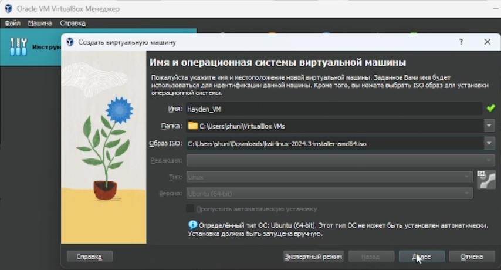{#fig:001 width=70%}

Образ Kali Linux был скачен заранее. Создадим виртуальную машину. Добавим новый привод оптических дисков и выберите образ операционной системы, укажем имя виртуальной машины, тип операционной системы -- Linux, RedHat (64-bit), рамзер основной памяти  -- 4096 МБ,  конфигурацию жёсткого диска — загрузочный, VDI (BirtualBox Disk Image), динамический виртуальный диск,  размер диска — 20 ГБ. На работу системе будут выделены 6 ядер процессора.

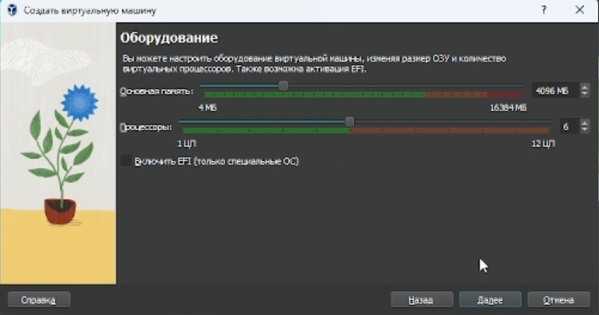{#fig:002 width=70%}

Запустим виртуальную машину, выберем English в качестве языка интерфейса.

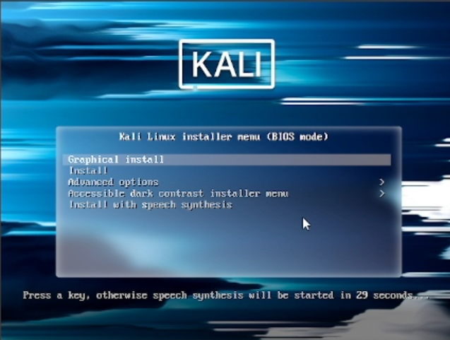{#fig:003 width=70%}

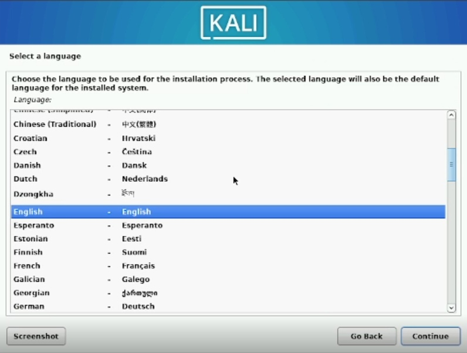{#fig:004 width=70%}

Создадим аккаунт пользователя(рис. @fig:005, @fig:006):

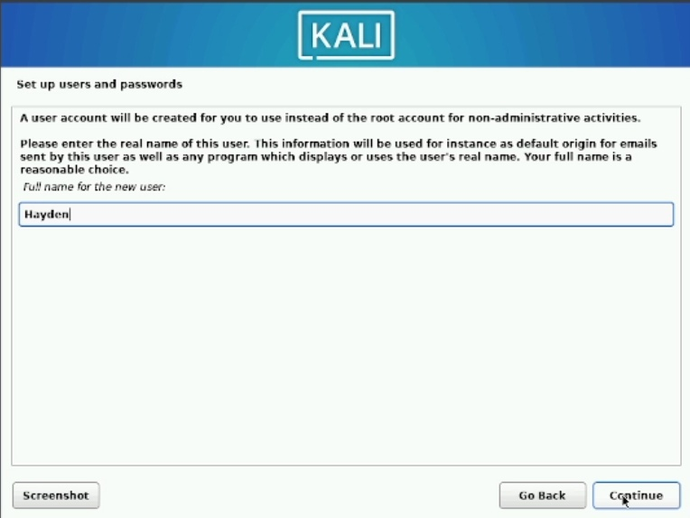{#fig:005 width=70%}

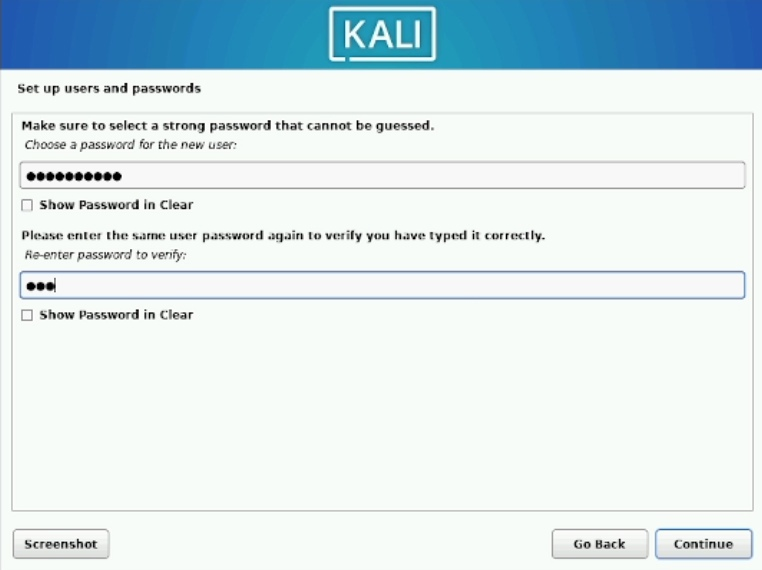{#fig:006 width=70%}

Разметим место на диске под операционную систему и файлы(рис. @fig:007, @fig:008, @fig:009 ):

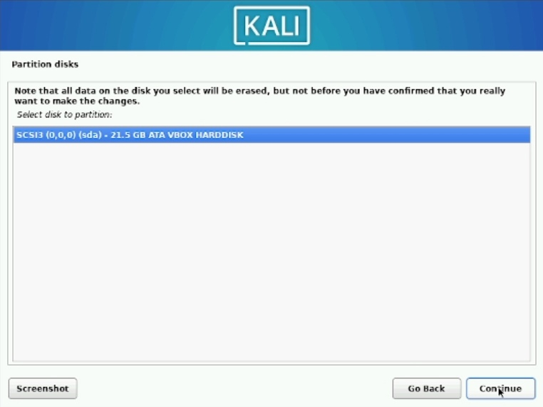{#fig:007 width=70%}

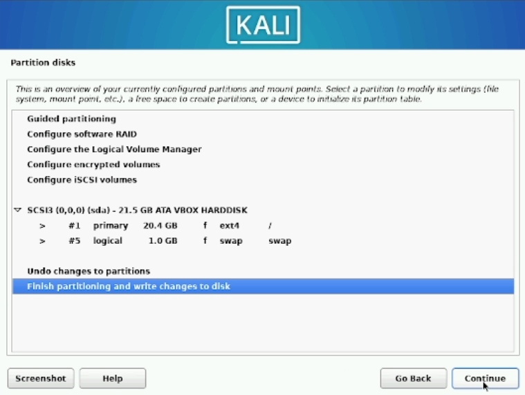{#fig:008 width=70%}

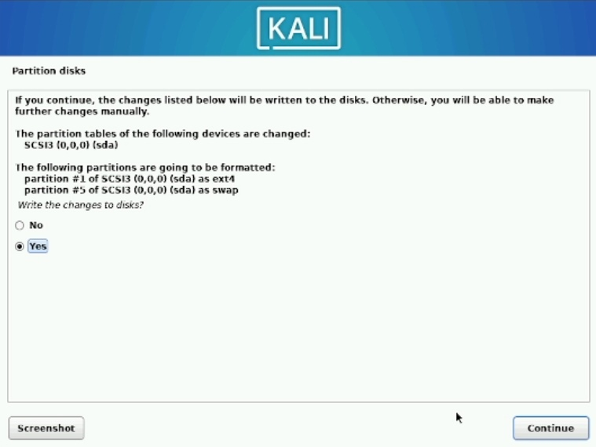{#fig:009 width=70%}

Установка дополнительного ПО и среды рабочего стола(рис. @fig:010):

{#fig:010 width=70%}

Установка загрузчика GRUB(рис. @fig:011):

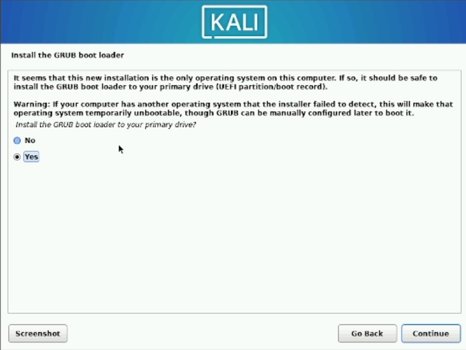{#fig:011 width=70%}

Вход в аккаунт пользователя(рис. @fig:012, @fig:013):

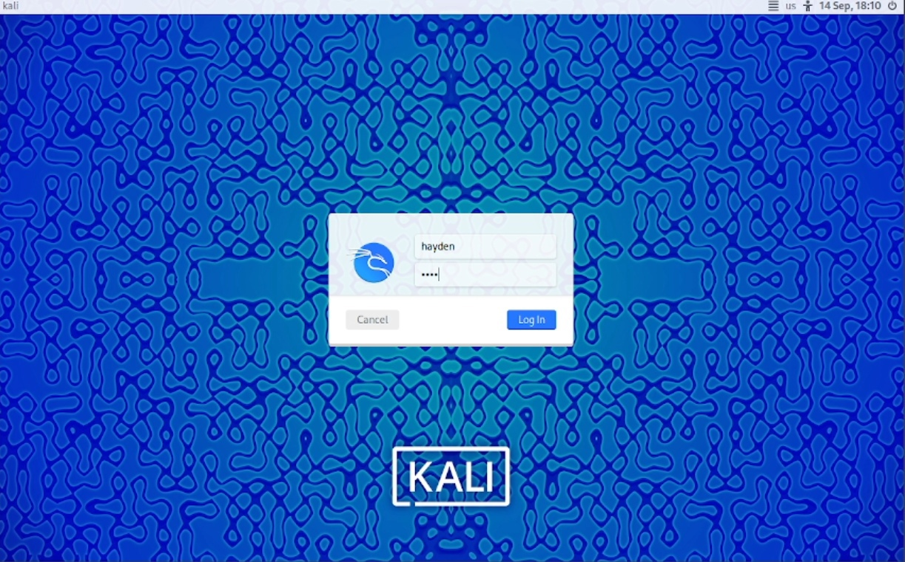{#fig:012 width=70%}

{#fig:013 width=70%}

# Выводы

В результате выполнения работы система Kali Linux была установлена на виртуальную машину и подготовлена для дальнейшей работыю

