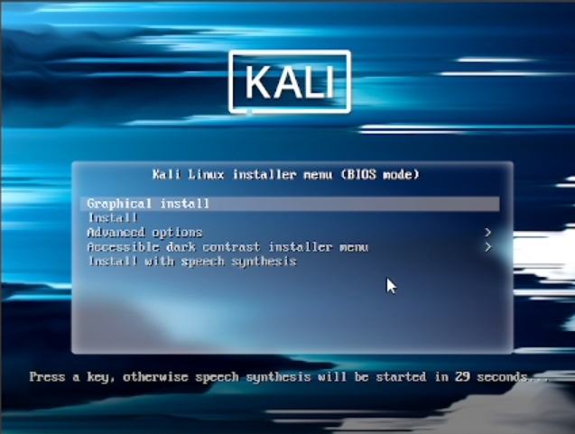
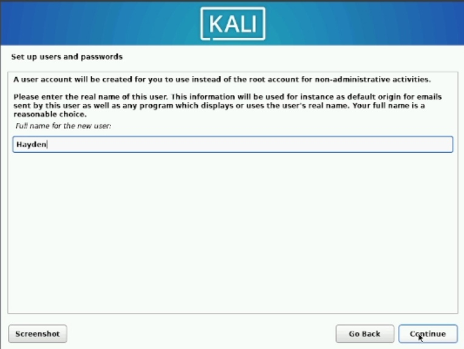
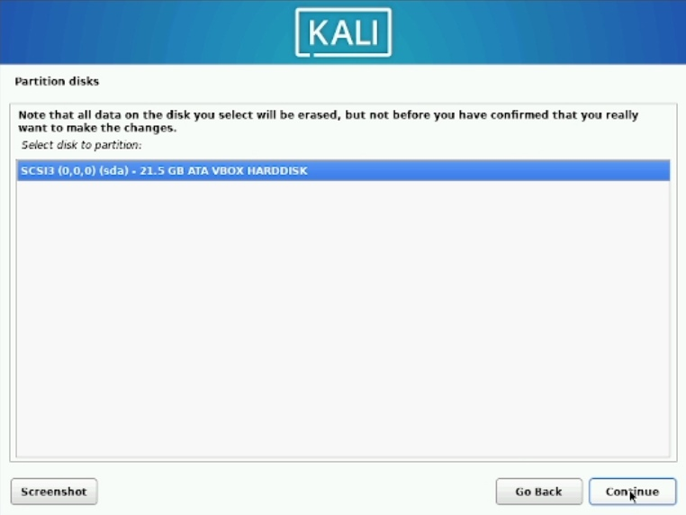
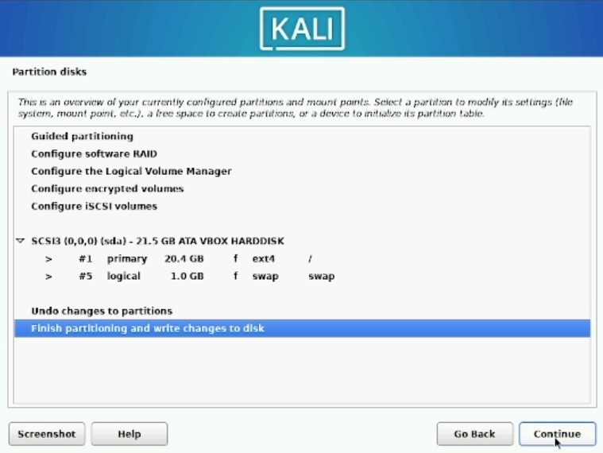

---
## Front matter
lang: ru-RU
title: "Основы информационной безопасности: Индивидуальный проект"
subtitle: "Этап № 1. Настройка виртуальной машины и установка операционной системы "
author: |
	Подлесный Иван Сергеевич.
institute: Российский Университет дружбы народов
date: 07.09.2024

## i18n babel
babel-lang: russian
babel-otherlangs: english

## Formatting pdf
toc: false
toc-title: Содержание
slide_level: 2
aspectratio: 169
section-titles: true
theme: metropolis
header-includes:
 - \metroset{progressbar=frametitle,sectionpage=progressbar,numbering=fraction}
 - '\makeatletter'
 - '\beamer@ignorenonframefalse'
 - '\makeatother'
---

# Информация

## Докладчик

  * Подлесный Иван Сергеевич
  * студент группы НКНбд-01-21
  * Российский университет дружбы народов

# Вводная часть

## Цель Работы
Целью данной работы является установка Kali Linux на виртуальную машину для дальнейшей работы с ней.

# Ход работы

## Подготовка virtualbox

Проверим в свойствах VirtualBox месторасположение каталога для виртуальных машин. Для этого в VirtualBox выберите Файл -> Настройки, вкладка Общие. 

{#fig:001 width=70%}

## Подготовка virtualbox

{#fig:002 width=70%}

## Установка ОС

{#fig:003 width=70%}

## Установка ОС

{#fig:004 width=70%}

## Установка ОС

Создадим аккаунт пользователя(рис. @fig:005, @fig:006):

{#fig:005 width=70%}

{#fig:006 width=70%}

## Установка ОС

{#fig:006 width=70%}

## Разметка памяти

{#fig:007 width=70%}

## Разметка памяти

{#fig:008 width=70%}

## Разметка памяти

{#fig:009 width=70%}

## Установка дополнительного ПО и среды рабочего стола 

{#fig:010 width=70%}

## Установка загрузчика GRUB 

{#fig:011 width=70%}

## Вход в аккаунт пользователя

{#fig:012 width=70%}

## Вход в аккаунт пользователя

{#fig:013 width=70%}

# Заключение

## Выводы

В результате выполнения работы были приобретены практические навыки установки операционной системы на виртуальную машину, настройки минимально необходимых для дальнейшей работы.

