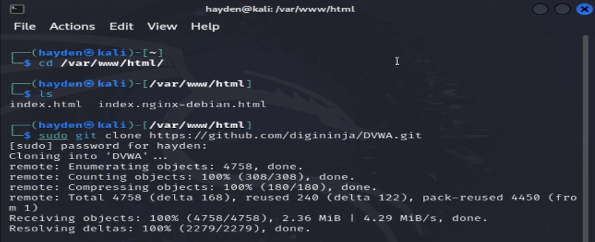
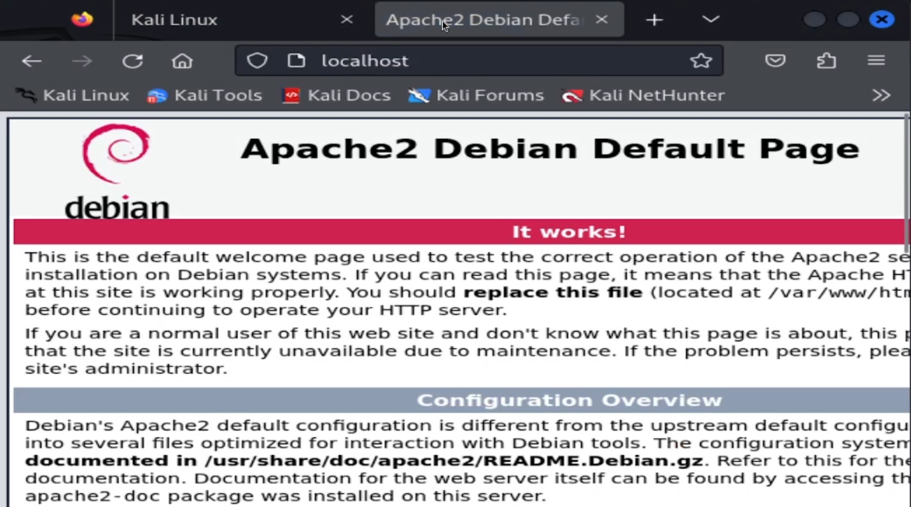
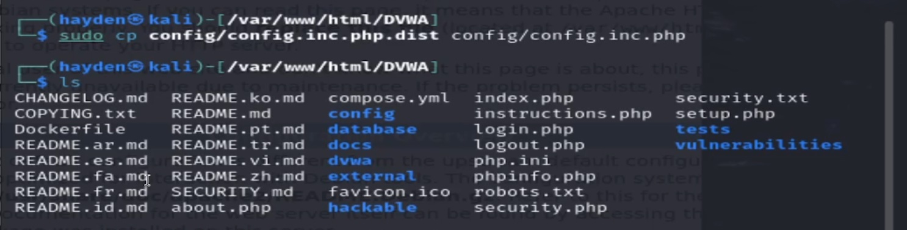
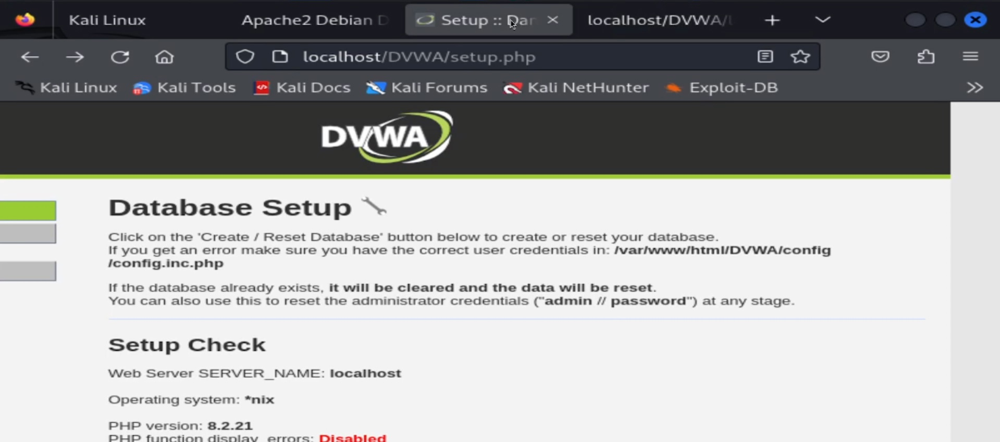
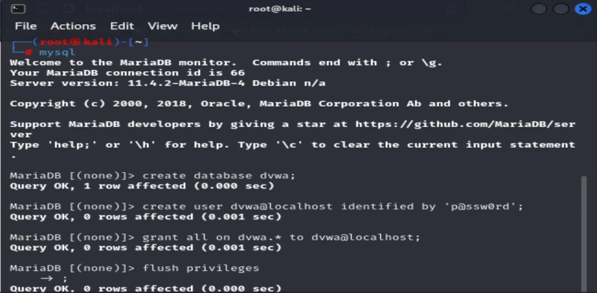
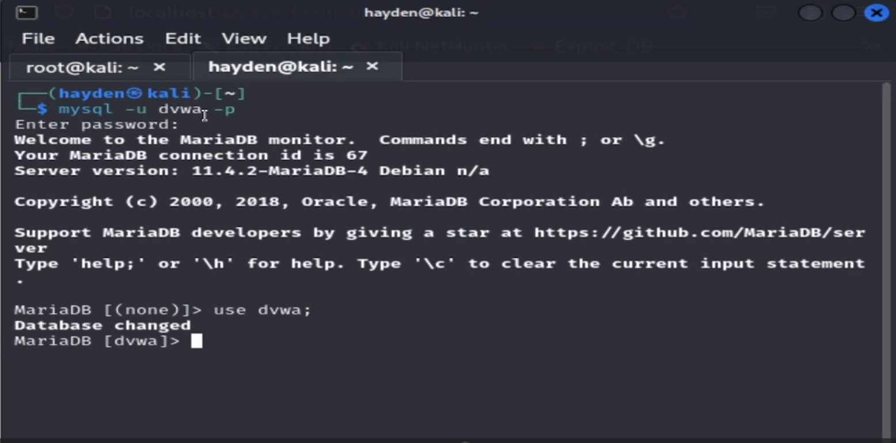
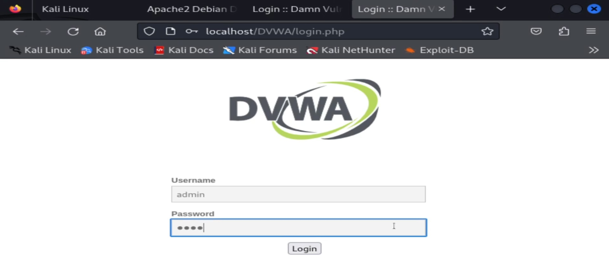
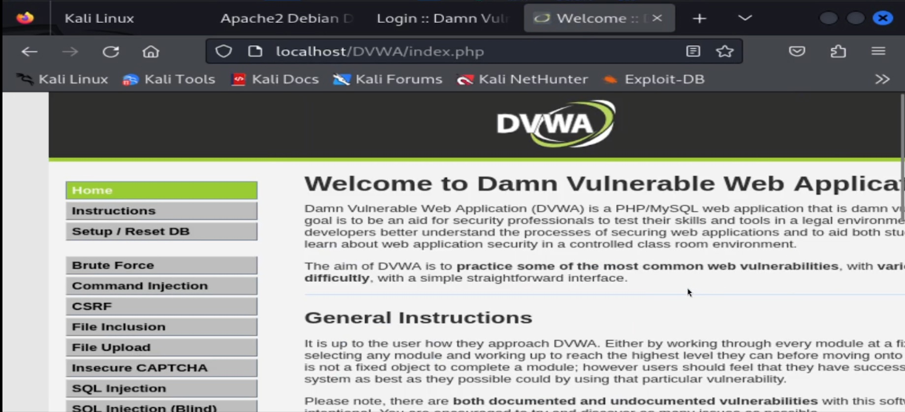

---
## Front matter
lang: ru-RU
title: "Основы информационной безопасности"
subtitle: "Индивидуальный проект. Этап № 2. Установка DVWA"
author: |
	Подлесный Иван Сергеевич.
institute: Российский Университет дружбы народов
date: 07.09.2024

## i18n babel
babel-lang: russian
babel-otherlangs: english

## Formatting pdf
toc: false
toc-title: Содержание
slide_level: 2
aspectratio: 169
section-titles: true
theme: metropolis
header-includes:
 - \metroset{progressbar=frametitle,sectionpage=progressbar,numbering=fraction}
 - '\makeatletter'
 - '\beamer@ignorenonframefalse'
 - '\makeatother'
---

# Информация

## Докладчик

  * Подлесный Иван Сергеевич
  * студент группы НКНбд-01-21
  * Российский университет дружбы народов

# Вводная часть

# Цель работы

Целью данной работы является установка DVWA на Kali Linux.

# Ход работы

# Теоретические сведения

Damn Vulnerable Web Application (DVWA) — это намеренно уязвимое веб-приложение на PHP/MySQL. Цель проекта — помочь этичным хакерам и специалистам ИБ отточить свои навыки и протестировать инструменты.

DVWA также может помочь веб-разработчикам и изучающим ИБ, лучше понять процесс безопасности веб-приложений.

## Подготовка к использованию DVWA

Скопируем в каталог /var/www/html файлы веб-приложения DVWA с гита(рис. @fig:001)

{#fig:001 width=70%}

## Запуск веб-сервера

Затем запускаем веб сервер(рис. @fig:002, @fig:003).

{#fig:003 width=70%}

## Настройка конфигурационного файла

Копируем файл конфигураций DVWA, чтобы затем можно было его безопасно изменять. Мы воспользуемся именем пользователя и паролем по умолчанию(рис. @fig:004, @fig:005).

{#fig:004 width=70%}

## Запуск стартового окна DVWA

{#fig:005 width=70%}

## Работа с сервером mariadb

Запустим сервер mariadb и создадим на нем пользователя(имя и пароль совпадают с данными в файле конфигураций dvwa)(рис. @fig:006, @fig:007).

{#fig:006 width=70%}

## Работа с сервером mariadb

{#fig:007 width=70%}

## Вход в DVWA

Затем на стартовом окне DVWA нажмем кнопку `Create/Reset Database`, и нас перекинет на страницу ввода данных учетной записи. После ввода увидим рабочую область DVWA(рис. @fig:008, @fig:009).

{#fig:008 width=70%}

## Главная страница DVWA

{#fig:009 width=70%}

# Заключение

## Выводы

В результате выполнения DVWA было установлено на Kali Linux.
