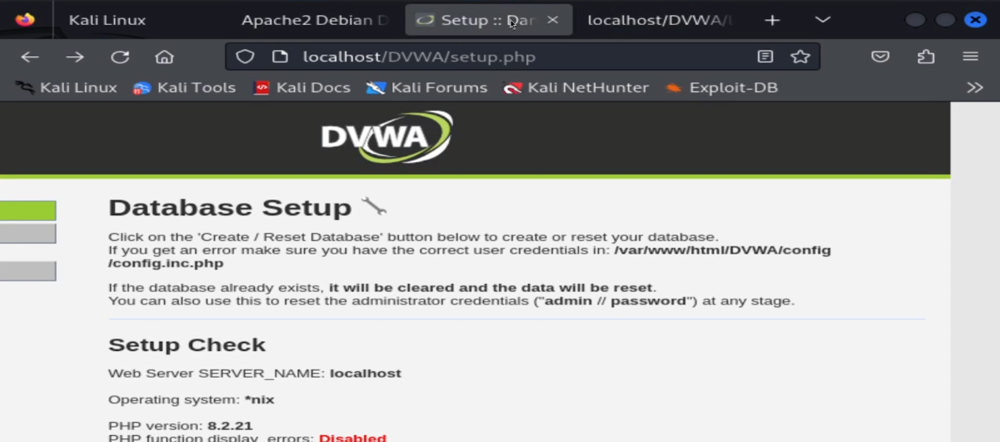

---
## Front matter
title: "Основы информационной безопасности"
subtitle: "Индивидуальный проект. Этап № 2. Установка DVWA"
author: "Подлесный Иван Сергеевич"

## Generic otions
lang: ru-RU
toc-title: "Содержание"

## Bibliography
bibliography: bib/cite.bib
csl: pandoc/csl/gost-r-7-0-5-2008-numeric.csl

## Pdf output format
toc: true # Table of contents
toc-depth: 2
lof: true # List of figures
lot: false # List of tables
fontsize: 12pt
linestretch: 1.5
papersize: a4
documentclass: scrreprt
## I18n polyglossia
polyglossia-lang:
  name: russian
  options:
	- spelling=modern
	- babelshorthands=true
polyglossia-otherlangs:
  name: english
## I18n babel
babel-lang: russian
babel-otherlangs: english
## Fonts
mainfont: PT Serif
romanfont: PT Serif
sansfont: PT Sans
monofont: PT Mono
mainfontoptions: Ligatures=TeX
romanfontoptions: Ligatures=TeX
sansfontoptions: Ligatures=TeX,Scale=MatchLowercase
monofontoptions: Scale=MatchLowercase,Scale=0.9
## Biblatex
biblatex: true
biblio-style: "gost-numeric"
biblatexoptions:
  - parentracker=true
  - backend=biber
  - hyperref=auto
  - language=auto
  - autolang=other*
  - citestyle=gost-numeric
## Pandoc-crossref LaTeX customization
figureTitle: "Рис."
tableTitle: "Таблица"
listingTitle: "Листинг"
lofTitle: "Список иллюстраций"
lotTitle: "Список таблиц"
lolTitle: "Листинги"
## Misc options
indent: true
header-includes:
  - \usepackage{indentfirst}
  - \usepackage{float} # keep figures where there are in the text
  - \floatplacement{figure}{H} # keep figures where there are in the text
---

# Цель работы

Целью данной работы является установка DVWA на Kali Linux.

# Теоретические сведения

Damn Vulnerable Web Application (DVWA) — это намеренно уязвимое веб-приложение на PHP/MySQL. Цель проекта — помочь этичным хакерам и специалистам ИБ отточить свои навыки и протестировать инструменты.

DVWA также может помочь веб-разработчикам и изучающим ИБ, лучше понять процесс безопасности веб-приложений.

# Ход работы

Скопируем в каталог /var/www/html файлы веб-приложения DVWA с гита(рис. @fig:001)

{#fig:001 width=70%}

Затем запускаем веб сервер(рис. @fig:002, @fig:003).

{#fig:003 width=70%}

Копируем файл конфигураций DVWA, чтобы затем можно было его безопасно изменять. Мы воспользуемся именем пользователя и паролем по умолчанию(рис. @fig:004, @fig:005).

{#fig:004 width=70%}

{#fig:005 width=70%}

Запустим сервер mariadb и создадим на нем пользователя(имя и пароль совпадают с данными в файле конфигураций dvwa)(рис. @fig:006, @fig:007).

{#fig:006 width=70%}

{#fig:007 width=70%}

Затем на стартовом окне DVWA нажмем кнопку `Create/Reset Database`, и нас перекинет на страницу ввода данных учетной записи. После ввода увидим рабочую область DVWA(рис. @fig:008, @fig:009).

{#fig:008 width=70%}

{#fig:009 width=70%}

# Выводы

В результате выполнения DVWA было установлено на Kali Linux.

