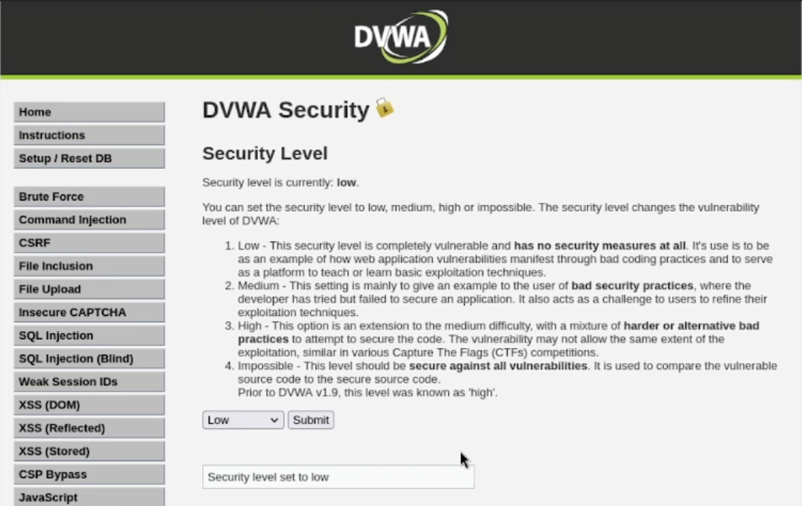
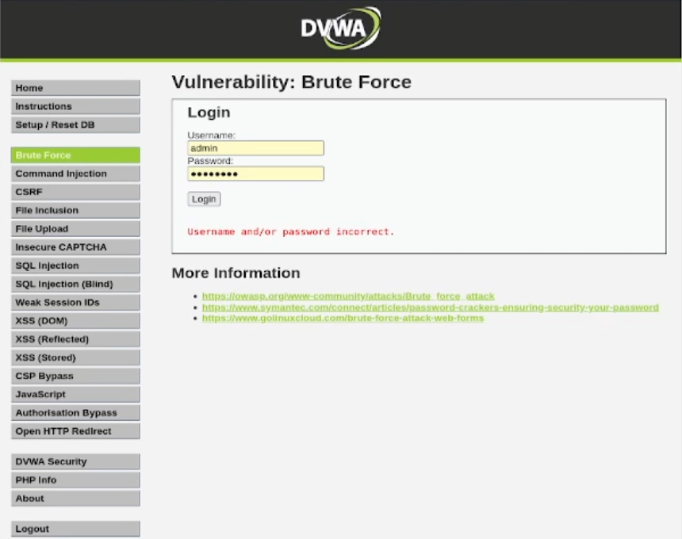
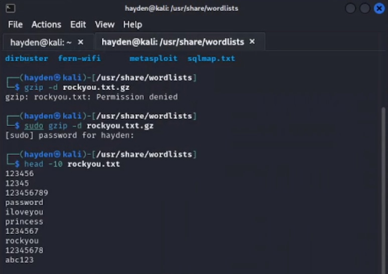
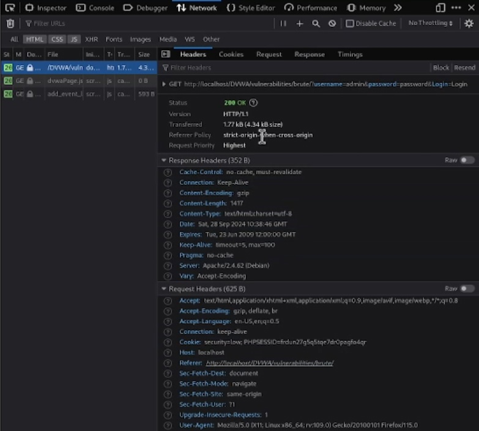
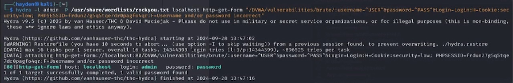
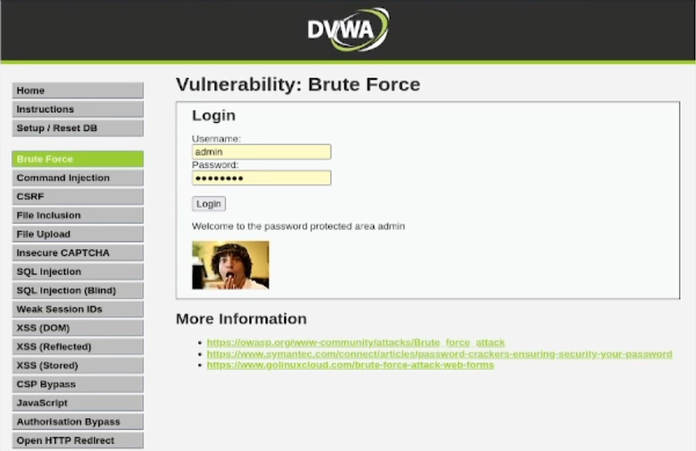

---
## Front matter
title: "Основы информационной безопасности"
subtitle: "Индивидуальный проект. Этап № 3. Использование Hydra"
author: "Подлесный Иван Сергеевич"

## Generic otions
lang: ru-RU
toc-title: "Содержание"

## Bibliography
bibliography: bib/cite.bib
csl: pandoc/csl/gost-r-7-0-5-2008-numeric.csl

## Pdf output format
toc: true # Table of contents
toc-depth: 2
lof: true # List of figures
lot: false # List of tables
fontsize: 12pt
linestretch: 1.5
papersize: a4
documentclass: scrreprt
## I18n polyglossia
polyglossia-lang:
  name: russian
  options:
	- spelling=modern
	- babelshorthands=true
polyglossia-otherlangs:
  name: english
## I18n babel
babel-lang: russian
babel-otherlangs: english
## Fonts
mainfont: PT Serif
romanfont: PT Serif
sansfont: PT Sans
monofont: PT Mono
mainfontoptions: Ligatures=TeX
romanfontoptions: Ligatures=TeX
sansfontoptions: Ligatures=TeX,Scale=MatchLowercase
monofontoptions: Scale=MatchLowercase,Scale=0.9
## Biblatex
biblatex: true
biblio-style: "gost-numeric"
biblatexoptions:
  - parentracker=true
  - backend=biber
  - hyperref=auto
  - language=auto
  - autolang=other*
  - citestyle=gost-numeric
## Pandoc-crossref LaTeX customization
figureTitle: "Рис."
tableTitle: "Таблица"
listingTitle: "Листинг"
lofTitle: "Список иллюстраций"
lotTitle: "Список таблиц"
lolTitle: "Листинги"
## Misc options
indent: true
header-includes:
  - \usepackage{indentfirst}
  - \usepackage{float} # keep figures where there are in the text
  - \floatplacement{figure}{H} # keep figures where there are in the text
---

# Цель работы

Целью данной работы является проведение brute-force атаки на приложение DVWA.

# Теоретические сведения

Damn Vulnerable Web Application (DVWA) — это намеренно уязвимое веб-приложение на PHP/MySQL. Цель проекта — помочь этичным хакерам и специалистам ИБ отточить свои навыки и протестировать инструменты.

DVWA также может помочь веб-разработчикам и изучающим ИБ, лучше понять процесс безопасности веб-приложений.

# Ход работы

Установим низкий уровень защиты DVWA(рис. @fig:001)

{#fig:001 width=70%}

Откроем страницу для проведения атаки brute force(рис. @fig:002).

{#fig:002 width=70%}

В Kali лежит файл с наиболее популярными паролями, распакуем его и увидим, что уже в начале есть пароль, который установлен по умолчанию для нашего аккаунта(рис. @fig:004, @fig:005).

{#fig:004 width=70%}

Рассмотрим данные о запросе на вход(рис. @fig:005).

{#fig:005 width=70%}

Исходные данные:

Исходные данные:
- IP сервера 178.72.90.181;
- Сервис http на стандартном 80 порту;
- Для авторизации используется html форма, которая отправляет по адресу http://localhost/DVWA/vulnerabilities/brutei методом POST запрос вида username=root&password=test_password;
- В случае не удачной аутентификации пользователь наблюдает сообщение Invalid username and/or password! Please try again.
- Запрос к Hydra будет выглядеть примерно так:

Запрос к Hydra будет следующим образом(рис. @fig:006):

{#fig:006 width=70%}

В результате получим нужный пароль(рис. @fig:007):

{#fig:007 width=70%}

# Выводы

В результате выполнения была успешно проведена brute-force атака на приложение DVWA.

