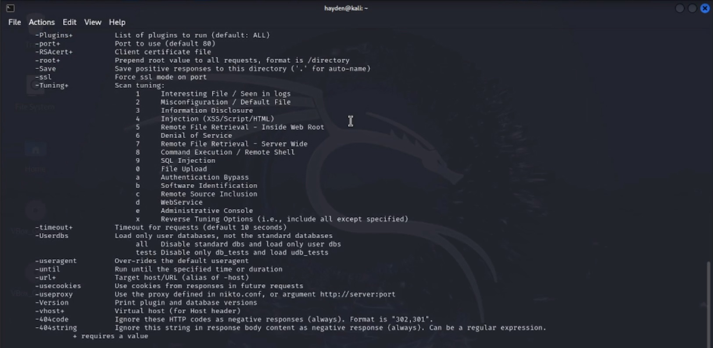
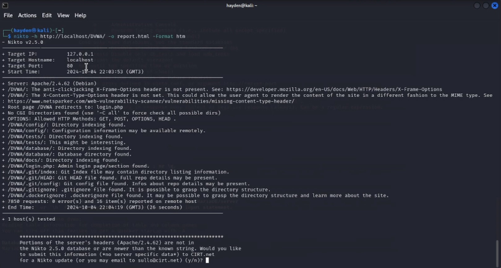
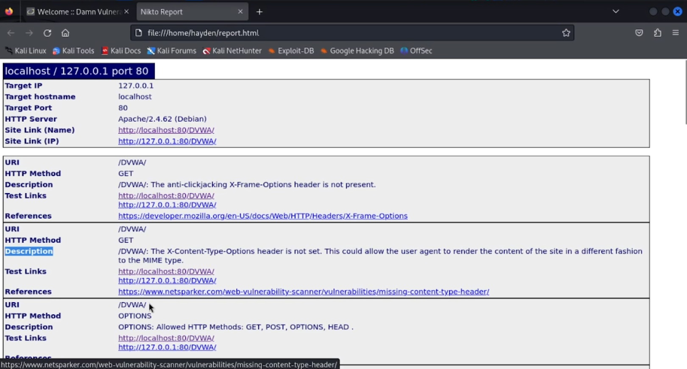
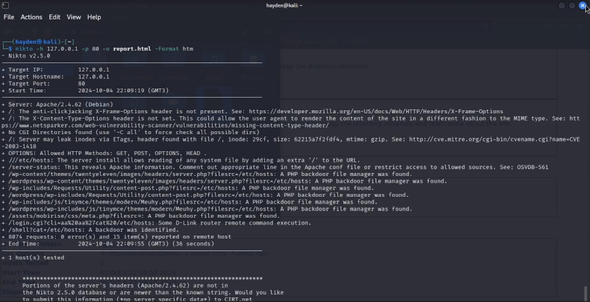

---
## Front matter
lang: ru-RU
title: "Основы информационной безопасности"
subtitle: "Индивидуальный проект. Этап № 4. Использование Nikto"
author: |
	Подлесный Иван Сергеевич.
institute: Российский Университет дружбы народов
date: 07.09.2024

## i18n babel
babel-lang: russian
babel-otherlangs: english

## Formatting pdf
toc: false
slide_level: 2
theme: metropolis
header-includes: 
 - \metroset{progressbar=frametitle,sectionpage=progressbar,numbering=fraction}
 - '\makeatletter'
 - '\beamer@ignorenonframefalse'
 - '\makeatother'
aspectratio: 43
section-titles: true
---

# Информация

## Докладчик

  * Подлесный Иван Сергеевич
  * студент группы НКНбд-01-21
  * Российский университет дружбы народов

# Вводная часть

# Цель работы

Целью данной работы является сканирование уязвимостей с помощью приложения Nikto

# Ход работы

## Проверим, что nikto установлен

{#fig:001 width=70%}

## Затем проверим сайт DVWA, указав опции для сохранения отчета в формате html

{#fig:002 width=70%}

## Просмотр отчета

{#fig:003 width=70%}

##  Посмотр информацию об уязвимостях по порту 80

{#fig:005 width=70%}

## Итог

В результате выполнения работы был использован сканер Nikto для сканирования уязвимостей веб-приложения.
