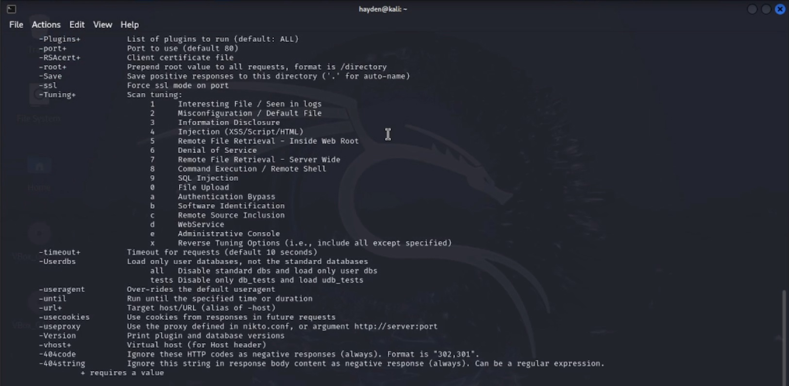
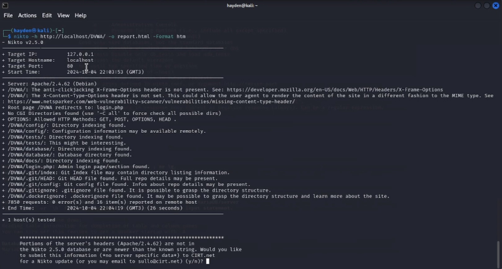
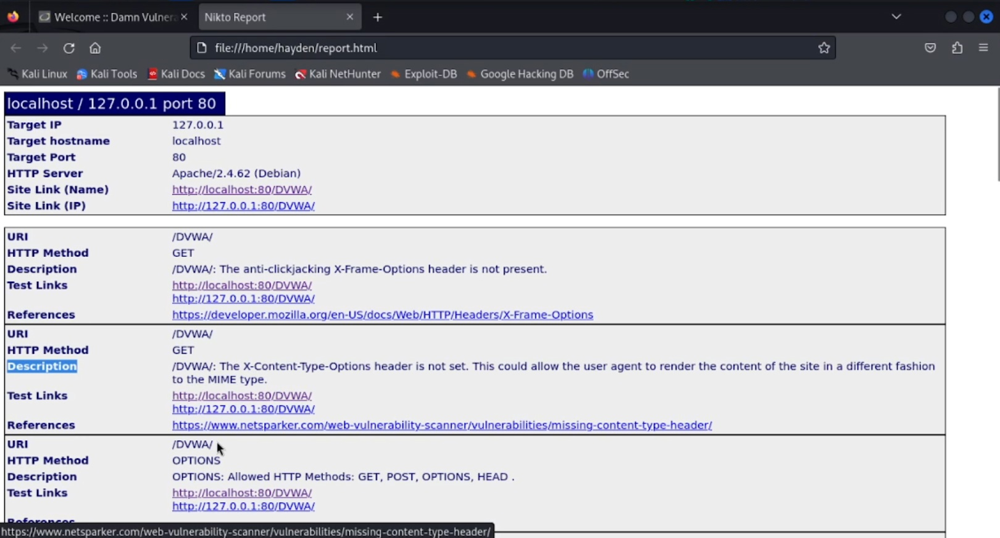
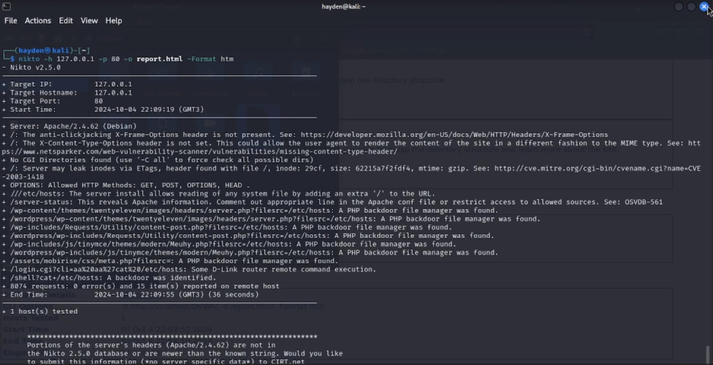

---
## Front matter
title: "Основы информационной безопасности"
subtitle: "Индивидуальный проект. Этап № 4. Использование Nikto"
author: "Подлесный Иван Сергеевич"

## Generic otions
lang: ru-RU
toc-title: "Содержание"

## Pdf output format
toc: true # Table of contents
toc-depth: 2
lof: true # List of figures
lot: false # List of tables
fontsize: 12pt
linestretch: 1.5
papersize: a4
documentclass: scrreprt
## I18n polyglossia
polyglossia-lang:
  name: russian
  options:
	- spelling=modern
	- babelshorthands=true
polyglossia-otherlangs:
  name: english
## I18n babel
babel-lang: russian
babel-otherlangs: english
## Fonts
mainfont: PT Serif
romanfont: PT Serif
sansfont: PT Sans
monofont: PT Mono
mainfontoptions: Ligatures=TeX
romanfontoptions: Ligatures=TeX
sansfontoptions: Ligatures=TeX,Scale=MatchLowercase
monofontoptions: Scale=MatchLowercase,Scale=0.9
## Biblatex
biblatex: true
biblio-style: "gost-numeric"
biblatexoptions:
  - parentracker=true
  - backend=biber
  - hyperref=auto
  - language=auto
  - autolang=other*
  - citestyle=gost-numeric
## Pandoc-crossref LaTeX customization
figureTitle: "Рис."
tableTitle: "Таблица"
listingTitle: "Листинг"
lofTitle: "Список иллюстраций"
lotTitle: "Список таблиц"
lolTitle: "Листинги"
## Misc options
indent: true
header-includes:
  - \usepackage[utf8]{inputenx}
  - \input{ix-utf8enc.dfu}
  - \usepackage[T2A]{fontenc}
  - \usepackage{indentfirst}
  - \usepackage{float} # keep figures where there are in the text
  - \floatplacement{figure}{H} # keep figures where there are in the text
---

# Цель работы

Целью данной работы является сканирование уязвимостей с помощью приложения Nikto

# Теоретические сведения

Damn Vulnerable Web Application (DVWA) — это намеренно уязвимое веб-приложение на PHP/MySQL. Цель проекта — помочь этичным хакерам и специалистам ИБ отточить свои навыки и протестировать инструменты.

DVWA также может помочь веб-разработчикам и изучающим ИБ, лучше понять процесс безопасности веб-приложений.

# Ход работы

Проверим, что nikto установлен(рис. @fig:001)

{#fig:001 width=70%}

Затем проверим сайт DVWA, указав опции для сохранения отчета в формате html(рис. @fig:002, ).

{#fig:002 width=70%}

{#fig:003 width=70%}

Можем увидеть, что найдены такие уязвимости как отсутствие защиты от кликджекинга, не установлен заголовок X-Content-Type-Options(в связи с чем пользователь может выполнить вредоносный контент не того типа, который предполагает администратор), возможность удаленного доступа к файлам конфигураций, также найдена скрытая папка git, в которой хранятся данные о структуре сайта.
В конце отчета указано, что найдено 16 уязвимостей.

Также можно посмотреть информацию об уязвимостях по конкретному порту(в нашем случае порт 80 для локального хоста)(рис. @fig:004).

{#fig:004 width=70%}

# Выводы

В результате выполнения работы был использован сканер Nikto для сканирования уязвимостей веб-приложения.

