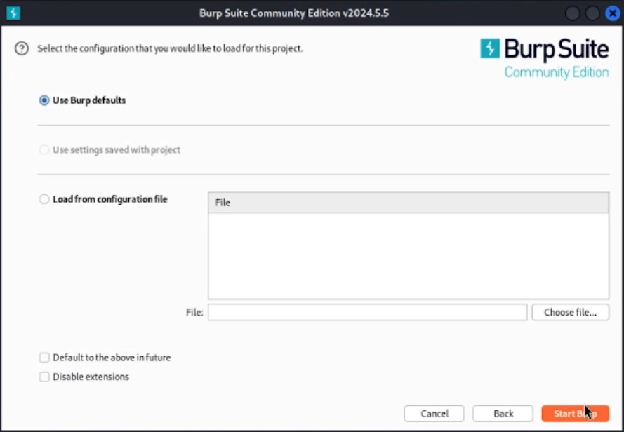
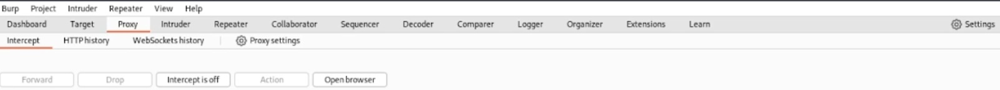
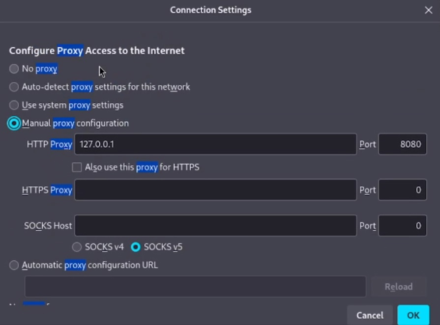
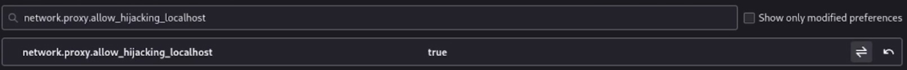
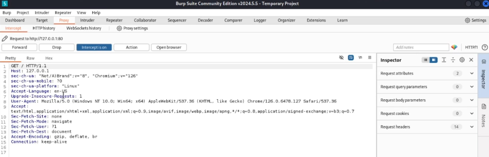
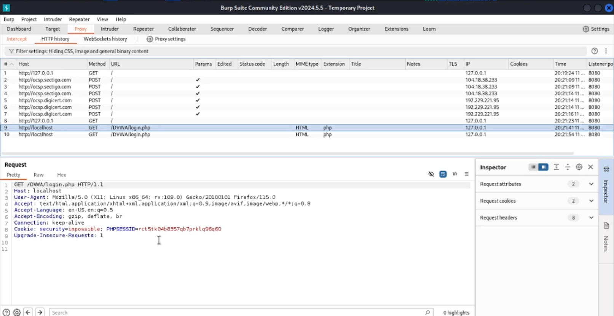
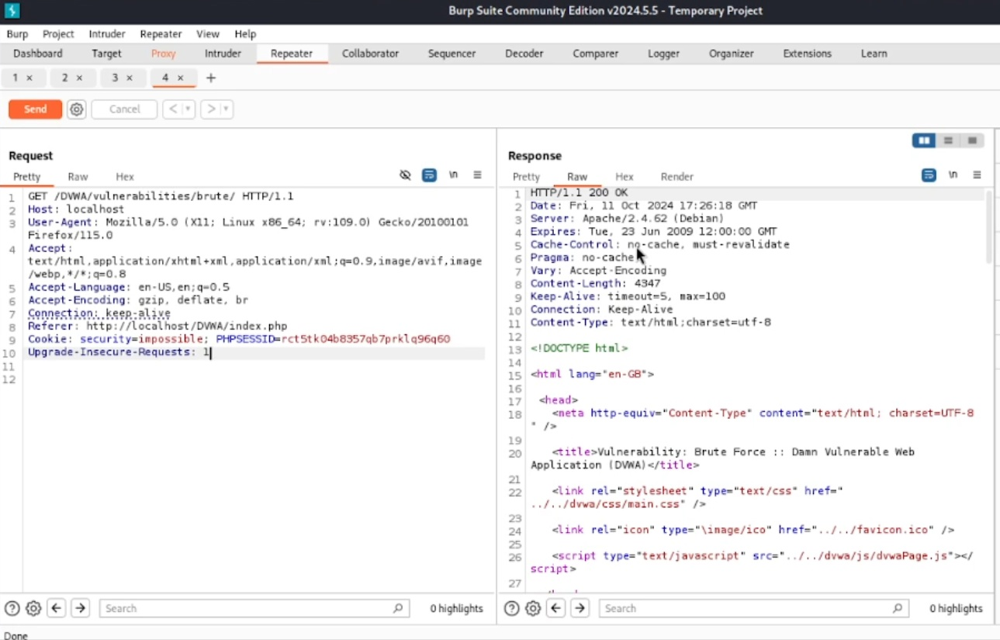

---
## Front matter
lang: ru-RU
title: "Основы информационной безопасности"
subtitle: "Индивидуальный проект. Этап № 5. Использование Burp Suite"
author: |
	Подлесный Иван Сергеевич.
institute: Российский Университет дружбы народов
date: 07.09.2024

## i18n babel
babel-lang: russian
babel-otherlangs: english

## Formatting pdf
toc: false
slide_level: 2
theme: metropolis
header-includes: 
 - \metroset{progressbar=frametitle,sectionpage=progressbar,numbering=fraction}
 - '\makeatletter'
 - '\beamer@ignorenonframefalse'
 - '\makeatother'
aspectratio: 43
section-titles: true
---

# Информация

## Докладчик

  * Подлесный Иван Сергеевич
  * студент группы НКНбд-01-21
  * Российский университет дружбы народов

# Вводная часть

# Цель работы

Целью данной работы является сканирование уязвимостей с помощью приложения Nikto

# Ход работы

## Burp Suite был установлен за кадром заранее
необходимо просто настроить ПО и создать проект

{#fig:001 width=70%}

##  попробуем перехватить http запрос с помощью Burp Proxy.
 Включим перехват, а в браузере включим прокси и укажем для него адрес локального хоста, а также установим параметр, разрешающий перехват запросов локального хоста

{#fig:004 width=70%}

##  попробуем перехватить http запрос с помощью Burp Proxy.
{#fig:005 width=70%}

##  попробуем перехватить http запрос с помощью Burp Proxy.

{#fig:006 width=70%}

##  Перехваченный запрос

Можем увидеть первый перехваченный запрос: вход на сайт DVWA. Указаны адрес локального хоста, версия браузера, ОС устройства и другая информация(рис. @fig:007):

{#fig:007 width=70%}

## Рассмотрим перехват запроса аутентификации(рис. @fig:008):

{#fig:008 width=70%}

Здесь дополнительно указываются куки запроса, а также выдается сам запрос с указанием введенного имени пользователя и пароля.

## совершенный запрос можно отпправить на повтор для того чтобы изучить ответы:

В запросах можно изменять вводимую нформацию и сравнивать ответы(рис. @fig:010):

{#fig:010 width=70%}

# Выводы

В результате выполнения работы научились на практике использовать ПО Burp Suite для перехвата, изменения и изучения HTTP запросов и ответов. 
