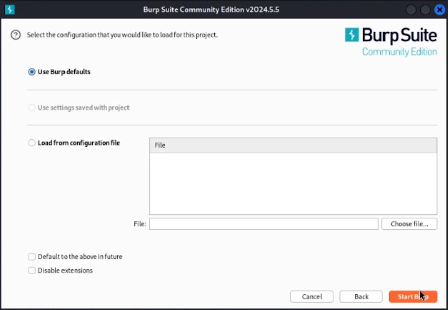
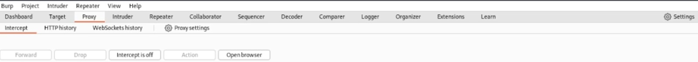
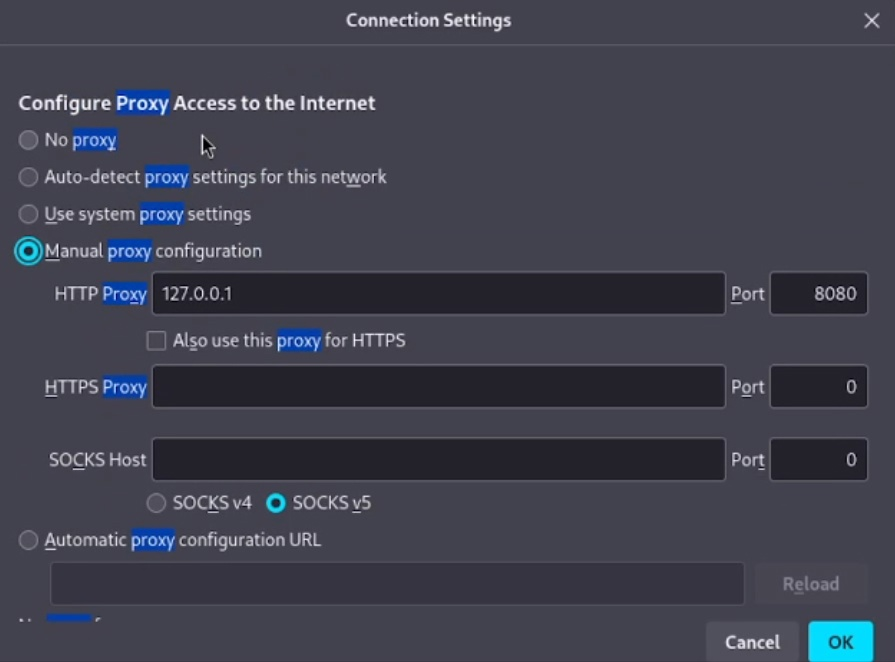
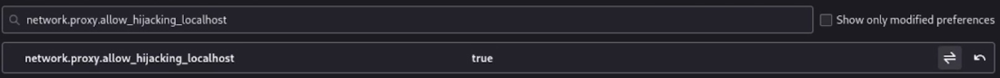
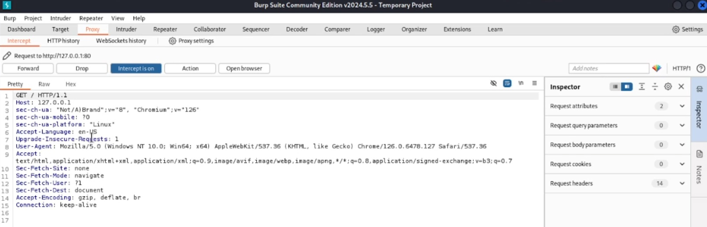
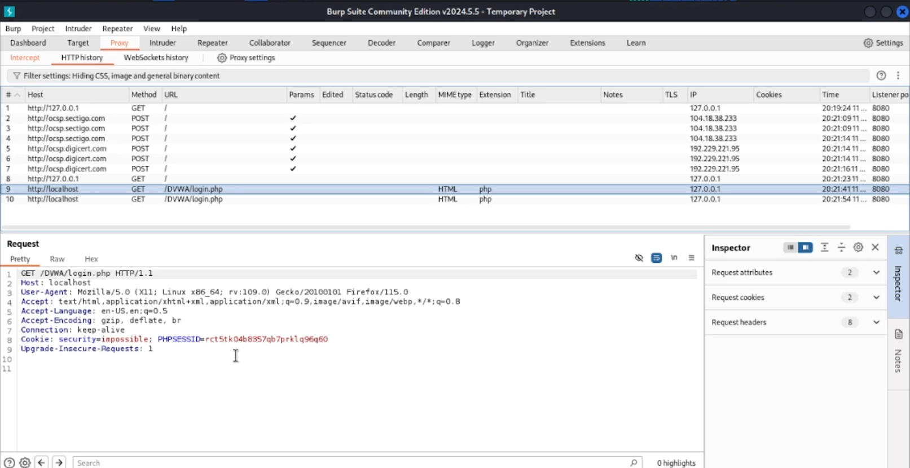
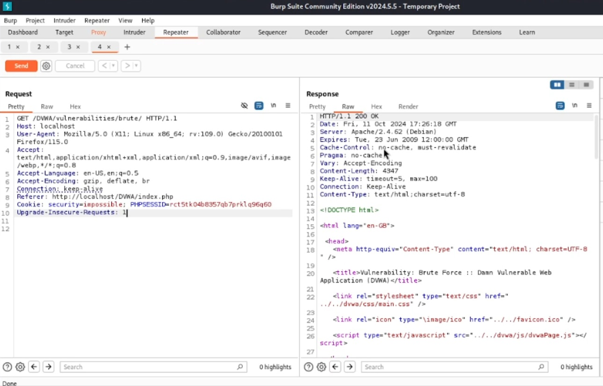

---
## Front matter
title: "Основы информационной безопасности"
subtitle: "Индивидуальный проект. Этап № 5. Использование Burp Suite"
author: "Подлесный Иван Сергеевич"

## Generic otions
lang: ru-RU
toc-title: "Содержание"

## Bibliography
bibliography: bib/cite.bib
csl: pandoc/csl/gost-r-7-0-5-2008-numeric.csl

## Pdf output format
toc: true # Table of contents
toc-depth: 2
lof: true # List of figures
lot: false # List of tables
fontsize: 12pt
linestretch: 1.5
papersize: a4
documentclass: scrreprt
## I18n polyglossia
polyglossia-lang:
  name: russian
  options:
	- spelling=modern
	- babelshorthands=true
polyglossia-otherlangs:
  name: english
## I18n babel
babel-lang: russian
babel-otherlangs: english
## Fonts
mainfont: PT Serif
romanfont: PT Serif
sansfont: PT Sans
monofont: PT Mono
mainfontoptions: Ligatures=TeX
romanfontoptions: Ligatures=TeX
sansfontoptions: Ligatures=TeX,Scale=MatchLowercase
monofontoptions: Scale=MatchLowercase,Scale=0.9
## Biblatex
biblatex: true
biblio-style: "gost-numeric"
biblatexoptions:
  - parentracker=true
  - backend=biber
  - hyperref=auto
  - language=auto
  - autolang=other*
  - citestyle=gost-numeric
## Pandoc-crossref LaTeX customization
figureTitle: "Рис."
tableTitle: "Таблица"
listingTitle: "Листинг"
lofTitle: "Список иллюстраций"
lotTitle: "Список таблиц"
lolTitle: "Листинги"
## Misc options
indent: true
header-includes:
  - \usepackage{indentfirst}
  - \usepackage{float} # keep figures where there are in the text
  - \floatplacement{figure}{H} # keep figures where there are in the text
---

# Постановка задачи

Целью данной работы является использование Burp Suit для перехвата, изменения и изучения HTTP запросов и ответов. 

# Выполнение лабораторной работы

Intercept HTTP traffic with Burp Proxy

Burp Suite был установлен за кадром заранее, так что необходимо просто настроить ПО и создать проект

{#fig:001 width=70%}

{#fig:003 width=70%}

Теперь попробуем перехватить http запрос с помощью Burp Proxy. Включим перехват, а в браузере включим прокси и укажем для него адрес локального хоста, а также установим параметр, разрешающий перехват запросов локального хоста(рис. @fig:004 - @fig:006).

{#fig:004 width=70%}

{#fig:005 width=70%}

{#fig:006 width=70%}

Можем увидеть первый перехваченный запрос: вход на сайт DVWA. Указаны адрес локального хоста, версия браузера, ОС устройства и другая информация(рис. @fig:007):

{#fig:007 width=70%}

Рассмотрим перехват запроса аутентификации(рис. @fig:008):

{#fig:008 width=70%}

Здесь дополнительно указываются куки запроса, а также выдается сам запрос с указанием введенного имени пользователя и пароля.

Кроме того уже совершенный запрос можно отпправить на повтор для того чтобы изучить ответы(рис. @fig:010):

В запросах можно изменять вводимую нформацию и сравнивать ответы(рис. @fig:010):

{#fig:010 width=70%}

# Выводы

В результате выполнения работы научились на практике использовать ПО Burp Suite для перехвата, изменения и изучения HTTP запросов и ответов. 
